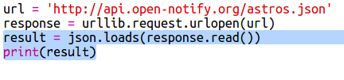
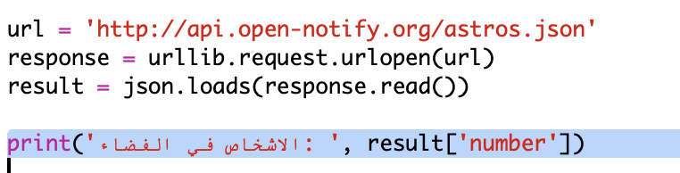

## من الموجودون في الفضاء؟

ستستخدم خدمة ويب توفر لك معلومات حية عن الفضاء. لنعرف أولًا من الموجودون حاليًا في الفضاء. 


+ لخدمة الويب عنوان (url) كصفحة الويب تمامًا. وبدلًا من إرجاع HTML لصفحة ويب، تقوم بإرجاع البيانات. 

    افتح <a href="http://api.open-notify.org/astros.json" target="_blank">http://api.open-notify.org/astros.json</a> في متصفح ويب. 

    سترى شيئًا كهذا:

    ```
    {
      "message": "success", 
      "number": 3, 
      "people": [
        {
          "craft": "ISS", 
          "name": "Yuri Malenchenko"
        }, 
        {
          "craft": "ISS", 
          "name": "Timothy Kopra"
        }, 
        {
          "craft": "ISS", 
          "name": "Timothy Peake"
        }
      ]
    }
    ```

    هذه البيانات حية، لذا سترى نتيجة مختلفة. تُسمى هذه الصيغة JSON (تُنطق جاسون). 

+ لنقم باستدعاء خدمة الويب من Python حتى يمكننا استخدام النتائج.

    افتح مشروع trinket هذا: <a href="http://jumpto.cc/iss-go" target="_blank">jumpto.cc/iss-go</a>. 

+ تم استيراد الوحدتين `urllib.request` و`json` بالفعل لمساعدتك. 

    أضف التعليمة البرمجية التالية إلى الملف `main.py` لوضع عنوان الويب الذي استخدمتَه للتو داخل متغير:

    
   
+ لنقم الآن باستدعاء خدمة الويب:

    


+ ستحتاج بعد ذلك إلى تحميل استجابة JSON إلى بنية بيانات في Python:

    


    سترى شيئًا كهذا:

    ```
    {'message': 'success', 'number': 3, 'people': [{'craft': 'ISS', 'name': 'Yuri Malenchenko'}, {'craft': 'ISS', 'name': 'Timothy  Kopra'}, {'craft': 'ISS', 'name': 'Timothy Peake'}]}
    ```

    هذا قاموس Python يحتوي على 3 مفاتيح: `message` و`number` و`people`. 

    تخبرك قيمة `success` للمفتاح message أن الطلب قد تم بنجاح. جيد. 

    لاحظ أنك سترى نتائج مختلفة وفقًا للأشخاص الموجودين في الفضاء حاليًا!

+ لنقم الآن بطباعة المعلومات بطريقة أسهل في القراءة. 

    أولًا، لنبحث عن عدد الأشخاص الموجودين في الفضاء ونطبعه:
  
    

    ستطبع `result['number']` القيمة المقترنة بالمفتاح 'number' في القاموس 'result'. في المثال الموضح، القيمة هي `3`. 

+ إن القيمة المقترنة بالمفتاح 'people' هي قائمة قواميس! لنطبع هذه القيمة داخل متغير بحيث يمكنك استخدامها:

    


    سترى شيئًا كهذا: 
    
    ```
    [{'craft': 'ISS', 'name': 'Yuri Malenchenko'}, {'craft': 'ISS', 'name': 'Timothy Kopra'}, {'craft': 'ISS', 'name': 'Timothy Peake'}]
    ```

+ تحتاج الآن إلى طباعة سطر لكل رائد فضاء.

    يمكنك استخدام حلقة `for` للقيام بذلك في Python. في كل مرة ضمن الحلقة، سيتم تعيين`p` إلى قاموس لرائد فضاء مختلف.

    

+ يمكنك عندئذٍ البحث عن قيم `name` و`craft`

    
  
    سترى شيئًا كهذا:

    ```
    People in Space:  3
    Yuri Malenchenko
    Timothy Kopra
    Timothy Peake
    ```

    تذكَّر أنك تستخدم بيانات حية، لذا ستعتمد نتائجك على عدد الأشخاص الموجودين حاليًا في الفضاء. 


