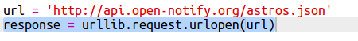
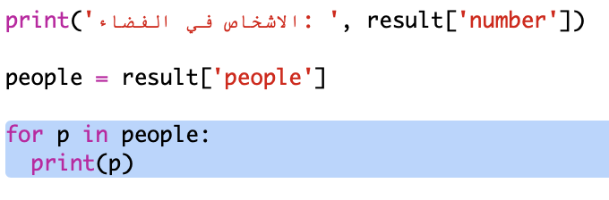
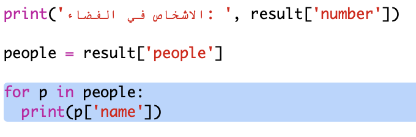

## من في الفضاء؟

ستستخدم خدمة ويب توفر معلومات مباشرة عن الفضاء. أولاً ، دعنا نعرف من الموجود حاليًا في الفضاء.

تحتوي خدمة الويب على عنوان (URL) تمامًا مثل موقع الويب. بدلاً من إرجاع HTML لصفحة ويب ، فإنها تُرجع البيانات.

+ افتح <a href="http://api.open-notify.org/astros.json" target="_blank"> خدمة الويب </a> في متصفح الويب.

يجب أن نرى شيئا من هذا القبيل:
```
    {
      "message": "success",
      "number": 3,
      "people": [
        {
          "craft": "ISS",
          "name": "Yuri Malenchenko"
        },
        {
          "craft": "ISS",
          "name": "Timothy Kopra"
        },
        {
          "craft": "ISS",
          "name": "Timothy Peake"
        }
      ]
    }
```    

البيانات حية ، لذلك ربما ترى نتيجة مختلفة قليلاً. قائمة البيانات تسمى`JSON` (يتم نطقها تماما مثل اسم جيسون).

[[[generic-json]]]

تحتاج إلى الاتصال بخدمة الويب من برنامج نصي بلغة بايثون Python ، حتى تتمكن من استخدام النتائج.

+ افتح رابط trinket: <http://rpf.io/iss-on>{:target="_blank"}.

وحدات الـ`urllib.request` و `json` تم استيرادها من أجلك في الجزء العلوي من نص `main.py`.

+ أضف الكود التالي إلى `main.py` لتخزين عنوان URL لخدمة الويب التي وصلت إليها للتو كمتغير:


+ اتصل الآن بخدمة الويب:



+ ستحتاج بعد ذلك إلى تحميل استجابة JSON في بنية بيانات Python:


يجب أن نرى شيئا من هذا القبيل:
```
    {'message': 'success', 'number': 3, 'people': [{'craft': 'ISS', 'name': 'Yuri Malenchenko'}, {'craft': 'ISS', 'name': 'Timothy Kopra'}, {'craft': 'ISS', 'name': 'Timothy Peake'}]}
```    

هذا هو قاموس python مع ثلاث مفاتيح: `message`, `number`, و `people`.

[[[generic-python-key-value-pairs]]]

هذه `الرسالة` لديها القيمة `نجاح` تخبرك أنك نجحت في الوصول إلى خدمة الويب. لاحظ أنك سترى نتائج مختلفة للـ `رقم` و الـ`اشخاص` اعتمادا على من هو موجود حاليا في الفضاء.

الآن دعونا نطبع المعلومات بطريقة أكثر قابلية للقراءة.

+ أولاً ، دعنا نبحث عن عدد الأشخاص في الفضاء وطباعته:


`result['number']` سيطبع القيمة المرتبطة بـ `الرقم` في قاموس الـ `نتيجة` (result). في مثالنا هو `3`.

+ القيمة المرتبطة بـمفتاح `الأشخاص` هي قائمة من القواميس! لنضع هذه القيمة في متغير حتى تتمكن من استخدامها:


يجب أن نرى شيئا من هذا القبيل:
```
    [{'craft': 'ISS', 'name': 'Yuri Malenchenko'}, {'craft': 'ISS', 'name': 'Timothy Kopra'}, {'craft': 'ISS', 'name': 'Timothy Peake'}]
```    

+ الآن تحتاج إلى طباعة خط لكل رائد فضاء. يمكنك استخدام عبارة التكرار `for` في لغة البايثون Python من اجل ذلك.

[[[generic-python-for-loop-list]]]

+ في كل مرة من خلال الحلقة ،الحرف `p` سيتم تعيينه إلى قاموس لرائد فضاء مختلف.



+ يمكنك بعد ذلك البحث عن قيم `الاسم` و `الحرفية`. دعنا نظهر أسماء الأشخاص في الفضاء:



يجب أن نرى شيئا من هذا القبيل:
```
    الاشخاص في الفضاء:  3
    Yuri Malenchenko
    Timothy Kopra
    Timothy Peake
```    

**ملاحظة:**أنت تستخدم بيانات حية ، لذلك ستعتمد نتائجك على عدد الأشخاص الموجودين حاليًا في الفضاء.