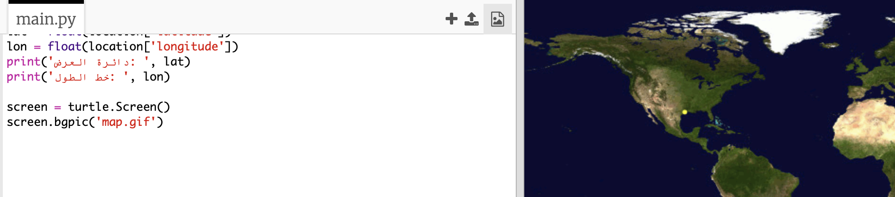
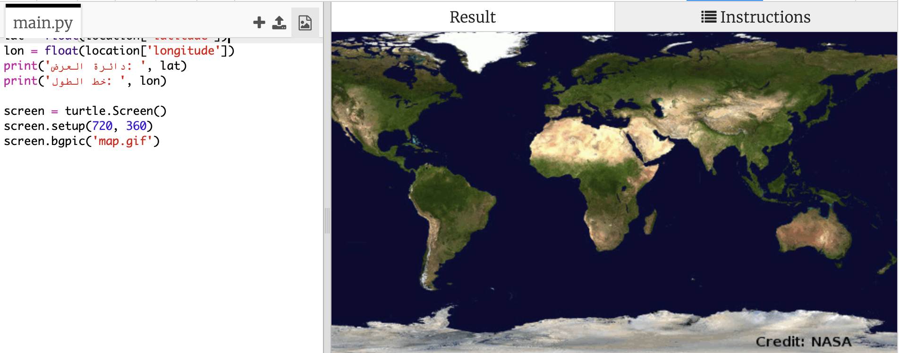

## أين توجد محطة الفضاء الدولية؟

تدور محطة الفضاء الدولية في مدار حول كوكب الأرض. وتُكمل دورة كاملة حول كوكب الأرض كل ساعة ونصف تقريبًا. حيث إن معدَّل سرعتها هو 7.66 كم في الثانية. فهي سريعة للغاية! 

لنستخدم خدمة ويب أخرى لمعرفة موقع محطة الفضاء الدولية. 


+ أولًا، افتح عنوان url لخدمة الويب في علامة تبويب جديدة على متصفح الويب: <a href="http://api.open-notify.org/iss-now.json" target="_blank">http://api.open-notify.org/iss-now.json</a>
  
    سترى شيئًا كهذا:
  
    ```
    {
    "iss_position": {
      "latitude": 8.54938193505081, 
      "longitude": 73.16560793639105
    }, 
    "message": "success", 
    "timestamp": 1461931913
    }
    ```
  
    تحتوي النتيجة على إحداثيَّي الموقع على كوكب الأرض الذي تمر محطة الفضاء الدولية فوقه حاليًا. 

    يمثل خط الطول الموقعَ على الجانب الشرقي أو الغربي للكرة الأرضية وتبدأ إحداثياته من -180 درجة إلى 180 درجة. وعند الدرجة 0، يكون خط الطول الرئيسي (خط غرينتش) الذي يمر في مدينة غرينتش في لندن، المملكة المتحدة. 

    أما خط العرض فيمثل الموقعَ على الجانب الشمالي أو الجنوبي للكرة الأرضية، وتبدأ إحداثياته من 90 درجة إلى -90 درجة. وعند الدرجة 0، يكون خط العرض الرئيسي (خط الاستواء). 

+ تحتاج الآن إلى استدعاء خدمة الويب نفسها من Python. أضف التعليمات البرمجية التالية في نهاية المقطع البرمجي للحصول على الموقع الحالي لمحطة الفضاء الدولية:

    


+ لننشئ متغيرَين لتخزين إحداثيَّي خط الطول وخط العرض ثم طباعتهما:

    

+ سيكون من الأفضل عرض الموقع على خريطة.

    أولًا، سنحتاج إلى استيراد مكتبة جرافيكيات السلحفاة. 
  
    
  
+ لنقم بتحميل خريطة للعالم كصورة خلفية، توجد واحدة في trinket بالفعل.

    
  
    وفَّرت وكالة ناسا (NASA) هذه الخريطة الرائعة وسمحت بإعادة استخدامها. 
  
    تتمركز الخريطة عند الإحداثيَّين (0, 0) وهو ما تحتاج إليه بالفعل. 

+ ستحتاج إلى تعيين حجم الشاشة لمطابقة حجم الصورة الذي يبلغ 720 في 360. 

    أضف `(‏360 ,720)screen.setup`:

    
  
+ ستحتاج إلى إمكانية إرسال السلحفاة إلى خط طول وخط عرض معينَين. ولتسهيل ذلك، يمكننا ضبط الشاشة لمطابقة الإحداثيات التي نستخدمها:

     
  
    ستكون الإحداثيات الآن مطابقة لإحداثيَّي خط الطول وخط العرض اللذين حصلنا عليهما من خدمة الويب. 

+ لننشئ سلحفاة لمحطة الفضاء الدولية. 

    

    يحتوي مشروعك على 'iss.png' و'iss2.png'، جرِّبهما واختر الصورة التي تفضلها. 

+ تظهر محطة الفضاء الدولية في منتصف الخريطة في البداية، لذا سنحرِّكها إلى الموقع الصحيح على الخريطة:

    
  
    لاحظ أنه عادةً ما يُعرض خط العرض أولًا، لكننا سنحتاج إلى إدخال خط الطول أولًا عند تحديد إحداثيات (x,y). 

+ شغِّل برنامجك لاختباره. ستجد أن محطة الفضاء الدولية قد انتقلت إلى موقعها الحالي فوق كوكب الأرض. 

    انتظر بضع ثوانٍ وشغِّل البرنامج مرة أخرى لترى الموقع الذي انتقلت إليه محطة الفضاء الدولية. 

    


