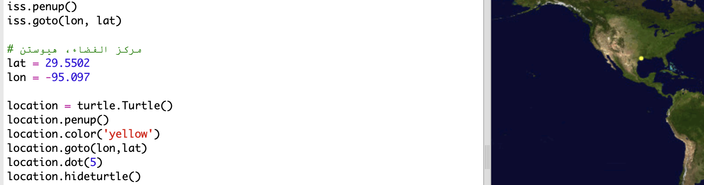
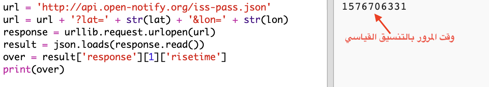

## متى ستكون محطة الفضاء الدولية فوق موقع معين مباشرة؟

توجد خدمة ويب أيضًا يمكنك استخدامها لمعرفة وقت المرور التالي لمحطة الفضاء الدولية فوق موقع معين. 

لنعرفْ وقت المرور التالي لمحطة الفضاء الدولية فوق مركز الفضاء في هوستون في الولايات المتحدة، حيث يقع هذا المركز عند إحداثي خط العرض 29.5502 وإحداثي خط الطول 95.097.
  
 

+ لنحدِّد أولًا نقطة على الخريطة يكون موقعها عند هذين الإحداثيَّين:

    

+ لنعرف الآن تاريخ ووقت المرور التالي لمحطة الفضاء الدولية فوق هذا الموقع. 

    كما سبق، يمكننا استدعاء خدمة الويب بإدخال عنوان url في شريط العناوين لمتصفح ويب: <a href="http://api.open-notify.org/iss-pass.json" target="_blank">http://api.open-notify.org/iss-pass.json</a>
  
    ستظهر رسالة خطأ:

    

+ تأخذ خدمة الويب هذه خط العرض وخط الطول كإدخالَين، لذا يجب أن نُدخلهما في عنوان url الذي نستخدمه.

    يُضاف الإدخالان بعد `?` ويفصل بينهما `&`. 

    أضف إدخالَي `lat` و`lon` إلى عنوان url كما هو موضح: <a href="http://api.open-notify.org/iss-pass.json?lat=29.55&lon=95.1" target="_blank">http://api.open-notify.org/iss-pass.json?lat=29.55&lon=95.1</a>
  
    
  
    تحتوي الاستجابة على أوقات كثيرة للمرور فوق هذا المركز، لكننا سننظر إلى الوقت الأول. يظهر الوقت بصيغة الوقت القياسية، لكن يمكنك تحويل هذه الصيغة إلى صيغة وقت يمكن قراءتها في Python.

+ لنقم الآن باستدعاء خدمة الويب من Python: أضف التعليمات البرمجية التالية في نهاية المقطع البرمجي:

    

+ لنأخذ الآن وقت المرور الأول من النتيجة.

    أضف التعليمات البرمجية التالية:

    

+ يُعطى الوقت كطابع زمني، لذا سنحتاج إلى وحدة الوقت في Python حتى يمكننا طباعة الوقت بصيغة يمكن قراءتها ثم تحويله إلى الوقت المحلي. لنطلب من السلحفاة كتابة وقت المرور بجوار النقطة الموجودة على الخريطة. 

أضف سطر `import time` أعلى المقطع البرمجي:

    

+ ستحوِّل الدالة `()time.ctime`الوقتَ إلى صيغة يمكن قراءتها ويمكنك كتابتها باستخدام السلحفاة: 

    
 
    (يمكنك حذف السطر `print` أو تعليقه).

