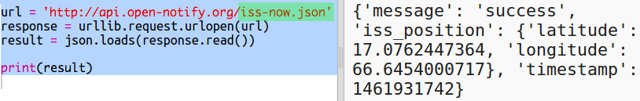
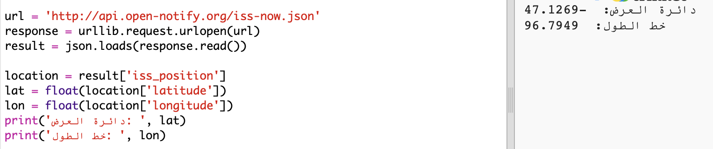

## أين هي محطة الفضاء الدولية؟

محطة الفضاء الدولية في مدار حول الأرض. وهي تكمل مدار الأرض تقريبًا كل ساعة ونصف ، وتسير بسرعة متوسطة تبلغ 7.66 كم في الثانية. إنها سريعة!

دعنا نستخدم خدمة ويب أخرى لمعرفة مكان محطة الفضاء الدولية.

+ أولاً ، افتح عنوان URL لخدمة الويب في علامة تبويب جديدة في متصفح الويب الخاص بك: <a href="http://api.open-notify.org/iss-now.json" target="_blank"> http://api.open-notify.org/iss-now.json </a>

يجب أن ترى شيئا من هذا القبيل:

    {
    "iss_position": {
      "latitude": 8.54938193505081, 
      "longitude": 73.16560793639105
    }, 
    "message": "success", 
    "timestamp": 1461931913
    }
    

تحتوي النتيجة على إحداثيات البقعة على الأرض التي يقع فيها النظام ISS حاليًا.

[[[generic-theory-lat-long]]]

+ أنت الآن بحاجة إلى الاتصال بنفس خدمة الويب من Python. أضف الكود التالي في نهاية البرنامج النصي للحصول على الموقع الحالي لمحطة الفضاء الدولية:

+ لنقم بإنشاء متغيرات لتخزين خطوط الطول والعرض ، ثم طباعتها:

