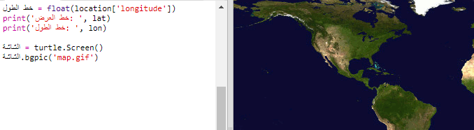
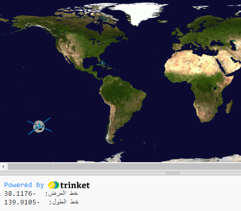

## رسم محطة الفضاء الدولية على الخريطة

سيكون من المفيد إظهار الموقع على الخريطة. يمكنك القيام بذلك باستخدام رسومات Python Turtle!

+ Load a world map as the background image. هناك واحدة مدرجة بالفعل في trinket تسمى "map.gif"! قدمت وكالة ناسا هذه الخريطة الجميلة ومنحت إذن لإعادة استخدامها. 

تتمركز الخريطة في خطوط الطول والعرض` (0،0) `، وهذا هو بالضبط ما تحتاجه.

+ تحتاج إلى ضبط حجم الشاشة لتتناسب مع حجم الصورة ، وهو 720 × 360 بكسل. Add `screen.setup(720, 360)`:

## \--- code \---

language: python filename: main.py line_numbers: true line_number_start: 26

## highlight_lines: 28, 29

# image source:

# map.jpg: http://visibleearth.nasa.gov/view.php?id=57752 Credit: NASA

screen = turtle.Screen() screen.setup(720, 360) \--- /code \---

+ تريد أن تكون قادرًا على إرسال السلحفاة إلى خطوط الطول والعرض بصفة خاصة. To make this easy, you can set the screen to match the coordinates you're using and add in the map image:

## \--- code \---

language: python filename: main.py line_numbers: true line_number_start: 27

## highlight_lines: 30, 31

# map.jpg: http://visibleearth.nasa.gov/view.php?id=57752 Credit: NASA

screen = turtle.Screen() screen.setup(720, 360) screen.setworldcoordinates(-180, -90, 180, 90) screen.bgpic('map.gif') \--- /code \---

ستقوم الإحداثيات الآن بمطابقة إحداثيات خطوط الطول والعرض التي تسترجعها من خدمة الويب.

+ Create a turtle icon for the ISS. يتضمن trinket الخاص بك "iss.gif" و "iss2.gif" - جربهما معًا واكتشف أيهما تفضل. 

[[[generic-python-turtle-image]]]

## \--- code \---

language: python filename: main.py line_numbers: true line_number_start: 33

## highlight_lines:

screen.register_shape('iss.gif') iss = turtle.Turtle() iss.shape('iss.gif') iss.setheading(90) \--- /code \---

+ The ISS starts off in the centre of the map, now move it to the correct location:

## \--- code \---

language: python filename: main.py line_numbers: true line_number_start: 38

## highlight_lines:

iss.penup() iss.goto(lon, lat) \--- /code \---

** ملاحظة **: يتم إعطاء خط العرض عادةً أولاً ، لكننا نحتاج إلى إعطاء خط الطول أولاً عند تنسيق التخطيط ` (x,y) `.

+ اختبار البرنامج الخاص بك عن طريق تشغيله. يجب أن تنتقل المحطة الفضائية الدولية إلى موقعها الحالي فوق الأرض. 

+ انتظر بضع ثوان وقم بتشغيل البرنامج مرة أخرى لترى أين انتقلت محطة الفضاء الدولية.