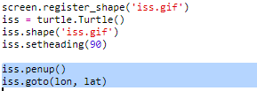

## التخطيط لمحطة الفضاء الدولية على الخريطة

سيكون من المفيد إظهار الموقع على الخريطة. يمكنك القيام بذلك باستخدام رسومات Python Turtle!

+ اولا نحتاج لاستيراد مكتبة `turtle` Python:

+ بعد ذلك ، قم بتحميل خريطة العالم كصورة خلفية. هناك واحد مدرج بالفعل في trinket تسمى "map.gif"! قدمت وكالة ناسا هذه الخريطة الجميلة ومنحت إذن لإعادة استخدامها. 

تتمركز الخريطة في ` (0،0) ` خطوط الطول والعرض ، وهذا هو بالضبط ما تحتاجه.

+ تحتاج إلى ضبط حجم الشاشة لتتناسب مع حجم الصورة ، وهو 720 × 360 بكسل. اضافة`screen.setup(720, 360)`:

+ تريد أن تكون قادرًا على إرسال السلحفاة إلى خطوط الطول والعرض بصفة خاصة. لتسهيل ذلك ، يمكنك ضبط الشاشة لمطابقة الإحداثيات التي تستخدمها:

ستقوم الإحداثيات الآن بمطابقة إحداثيات خطوط الطول والعرض التي تسترجعها من خدمة الويب.

+ لنقم بإنشاء أيقونة سلحفاة لمحطة الفضاء الدولية. يتضمن trinket الخاص بك "iss.gif" و "iss2.gif" - جربهما معًا واكتشف أيهما تفضل. 

[[[generic-python-turtle-image]]]

\--- hints \--- \--- hint \---

يجب أن تبدو التعليمات البرمجية خاصتك بالشكل التالي:

\--- /hint \--- \--- /hints \---

+ يبدأ تشغيل ISS في وسط الخريطة ، والآن دعنا ننتقل إلى الموقع الصحيح:

** ملاحظة **: يتم إعطاء خط العرض عادةً أولاً ، لكننا نحتاج إلى إعطاء خط الطول أولاً عند تنسيق التخطيط ` (x,y) `.

+ اختبار البرنامج الخاص بك عن طريق تشغيله. يجب أن تنتقل المحطة الفضائية الدولية إلى موقعها الحالي فوق الأرض. 

+ انتظر بضع ثوان وقم بتشغيل البرنامج مرة أخرى لترى أين انتقلت محطة الفضاء الدولية.