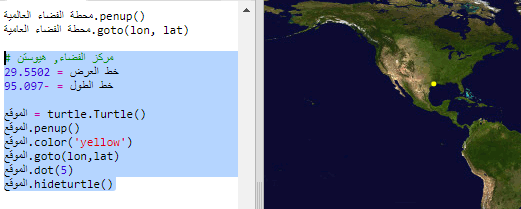
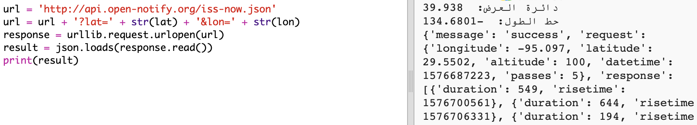
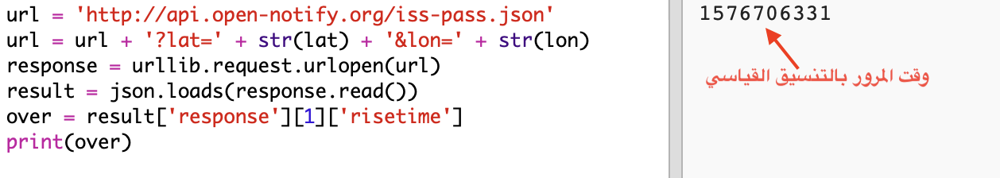
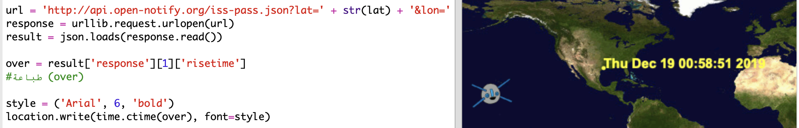

## متى ستكون المحطة الفضائية الدولية فوقنا؟

هناك أيضًا خدمة ويب يمكنك استخدامها لمعرفة متى ستكون محطة الفضاء ISS في موقع معين.

دعنا نعرف متى ستكون محطة الفضاء الدولية بعد ذلك في مركز الفضاء في هيوستن ، الولايات المتحدة الأمريكية ، التي تقع عند خط العرض ` 29.5502 ` وخط الطول ` 95.097 `.

+ أولاً دعنا نرسم نقطة على الخريطة في هذه الإحداثيات:

الآن دعنا نحصل على التاريخ والوقت الذي تكون فيه محطة الفضاء الدولية فوقنا مرة اخرى.

+ كالسابق، يمكنك الاتصال بخدمة الويب عن طريق إدخال عنوان URL الخاص بها في شريط العناوين في متصفح الويب: <a href="http://api.open-notify.org/iss-pass.json" target="_blank"> api.open-notify.org/iss-pass.json </a>

يجب أن تشاهد خطأ:

تأخذ خدمة الويب هذه خطوط الطول والعرض كمدخلات ، لذلك يتعين عليك تضمينها في عنوان URL. يتم إضافة المدخلات بعد `؟ ` ويفصل مع `&`.

+ قم باضافة المدخلات `lat` و `lon` الى العنوان url كما هو موضح: <a href="http://api.open-notify.org/iss-pass.json?lat=29.55&lon=95.1" target="_blank">api.open-notify.org/iss-pass.json?lat=29.55&lon=95.1</a>

تشمل الاستجابة على العديد من أوقات التمرير ، وسنلقي نظرة على الأول منها. يتم إعطاء الوقت كختم زمني لـ Unix (ستتمكن من تحويله إلى وقت قابل للقراءة في برنامج Python النصي الخاص بك).

[[[generic-unix-timestamp]]]

+ الآن دعنا ندعو خدمة الويب من Python. أضف الكود التالي إلى نهاية البرنامج النصي:

+ الآن دعنا نحصل على أول مرة للتمرير من النتيجة. أضف الكود التالي:

سنحتاج إلى الوحدة النمطية `time` من لغة بايثون Python حتى jتمكن من طباعته في شكل مقروء وتحويله إلى التوقيت المحلي. بعد ذلك ، سنحصل على البرنامج النصي لكتابة وقت المرور عبر النقطة الخاصة بهيوستن.

+ قم باضافة السطر `import time` في الجزء العلوي من البرنامج النصي الخاص بك:

+ إن دالة `time.ctime()` تعمل على تحويل الطابع الزمني إلى نموذج قابل للقراءة يمكنك كتابته على خريطتك:

(يمكنك إزالة سطر الطباعة ` `، أو تحويله إلى تعليق عن طريق إضافة ` # ` في البداية حتى يتجاهله البرنامج النصي الخاص بك.)

+ إذا أردت ، يمكنك تغيير لون وتنسيق النص. 

[[[generic-python-turtle-write]]]