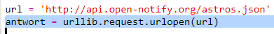
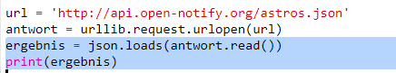
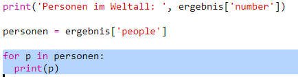

## Wer ist im Weltall?

Du wirst einen Web-Service benutzen, der dir Live Informationen über das Weltall bietet. Lass uns als erstes herausfinden, wer gerade im Weltall herumschwebt. 

+ Ein Web-Service hat eine Adresse (url), genauso wie bei einer Webseite. Anstelle von HTML für eine Webseite auszugeben, gibt dies Daten aus. 

Open <a href="http://api.open-notify.org/astros.json" target="_blank">http://api.open-notify.org/astros.json</a> in a web browser. 

Du solltest jetzt etwa Folgendes sehen können:

```
{
  "message" (Meldung): "success" (erfolgreich), 
  "number" (Zahl): 3, 
  "people" (Personen): [
    {
      "craft" (Weltraumstation): "ISS", 
      "name" (Name): "Yuri Malenchenko“
    }, 
    {
      "craft" (Weltraumstation): "ISS", 
      "name" (Name): "Timothy Kopra“
    }, 
    {
      "craft" (Weltraumstation): "ISS", 
      "name" (Name): "Timothy Peake"
    }
  ]
}
```

Diese Daten sind Live, du wirst daher also ein anderes Ergebnis sehen. Dieses Format nennt sich JSON (es wird englisch „Jason“ ausgesprochen). 

+ Lass uns jetzt den Web-Service von Python aufrufen, damit wir die  Ergebnisse benutzen können.

  Dieses Trinket öffnen: <a href="http://jumpto.cc/iss-go" target="_blank">jumpto.cc/iss-go</a>. 

+ Die `urllib.request` und `json` Module sind bereits für dich importiert worden. 

  Füge den folgenden Code zu `main.py` hinzu, um die Web-Adresse, die du gerade benutzt hast, in eine Variable umzusetzen:

  
   
+ Lass uns jetzt den Web-Service aufrufen:

  


+ Als nächstes musst du die JSON Antwort in eine Python Datenstruktur laden:

  


Du solltest jetzt etwa Folgendes sehen können:

```
{'message' (Meldung): 'success' (erfolgreich), 'number' (Zahl): 3, 'people' (Personen): [{'craft' (Weltraumstation): 'ISS', 'name': 'Yuri Malenchenko'}, {'craft': 'ISS', 'name': 'Timothy Kopra'}, {'craft': 'ISS', 'name': 'Timothy Peake'}]}
```

Dies ist ein Python Wörterbuch mit 3 Schlüsseln bestehend aus: der Meldung, der Zahl und der Personen. 

Der ‘success’ (erfolgreich) Wert der Meldung teilt dir mit, dass diese Anfrage erfolgreich war. Fabelhaft. 

Bitte beachte hierbei, dass du unterschiedliche Ergebnisse sehen wirst, je nachdem wer sich gerade im Weltall befindet!

+ Lass uns jetzt diese Informationen in einer lesbareren Art drucken. 

  Als erstes musst du nach der Anzahl von Personen im Weltall suchen und dies ausdrucken:
  
  

  `result['number']` (Ergebnis (Zahl)) wird den Wert, der mit dem Schlüssel ‘number’ (Zahl) im Ergebnis Wörterbuch verknüpft ist, drucken. In diesem Beispiel ist die Zahl `3`. 

+ Der Wert, der mit dem ‘people’ (Personen) Schlüssel verknüpft ist, ist eine Liste an Wörterbüchern! Lass uns jetzt diesen Wert in eine Variable umsetzen, damit du ihn benutzen kannst:

  


Du solltest jetzt etwa Folgendes sehen können: 
```
[{'craft' (Weltraumstation): 'ISS', 'name': 'Yuri Malenchenko'}, {'craft': 'ISS', 'name': 'Timothy Kopra'}, {'craft': 'ISS', 'name': 'Timothy Peake'}]
```

+ Jetzt musst du eine Zeile für jeden Astronauten drucken.

  Du kannst eine `for` (für) Schleife einfügen, um dies in Python zu machen. Jeder Durchgang durch die Schleife `p` wird im Wörterbuch für einen anderen Astronauten eingestellt.

  

+ Du kannst dann die Werte für ‘name’ (Name) und ‘craft’ (Weltraumstation) nachschlagen

  
  
  Du solltest jetzt etwa Folgendes sehen können:

  ```
  Personen im Weltall:  3
  Yuri Malenchenko
  Timothy Kopra
  Timothy Peake
  ```

  Du benutzt hier Live-Daten, die Ergebnisse hängen daher von der Anzahl der Personen ab, die sich gerade im Weltall aufhalten. 
