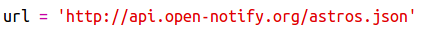
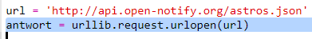
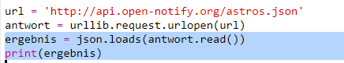
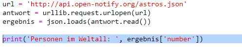
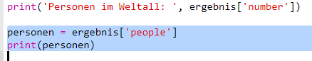
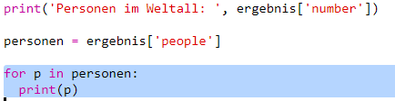
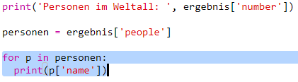

## Wer ist im Weltraum?

Du wirst einen Web Service verwenden der live Informationen über den Weltraum anbietet. Als erstes werden wir herausfinden wer im Weltraum ist.

Ein Web Service hat eine Adresse (URL) wie eine Website. Anstatt HTML für eine Webseite zurückzugeben, werden Daten zurückgegeben.

+ Öffne <a href="http://api.open-notify.org/astros.json" target="_blank"> den Web Service </a> in einem Webbrowser.

Dein Code sollte ungefähr so aussehen:

    {
      "message": "success",
      "number": 3,
      "people": [
        {
          "craft": "ISS",
          "name": "Yuri Malenchenko"
        },
        {
          " craft ":" ISS ",
          " name ":" Timothy Kopra "
        },
        {
          " craft ":" ISS ",
          " name ":" Timothy Peake "
        }
      ]
    }
    

Die Daten sind live, daher wirst du wahrscheinlich ein etwas anderes Ergebnis sehen. Das Datenformat heißt ` JSON ` (ausgesprochen wie "Jason").

[[[generic-json]]]

Du musst den Web Service über ein Python-Skript aufrufen, damit du die Ergebnisse verwenden kannst.

+ Öffne dieses Trinket: <http://rpf.io/iss-on>{:target="_blank"}.

Die ` urllib.request ` und `json` Module wurden bereits oben in der ` main.py ` Datei für dich importiert.

+ Füge den folgenden Code zu `main.py` hinzu, um die URL des Web Services, auf den du gerade zugegriffen hast, als Variable zu speichern:

+ Rufe nun den Web Service auf:

+ Als nächstes musst du die JSON-Antwort in eine Python-Datenstruktur laden:

Du solltest so etwas sehen:

    {'message': 'success', 'number': 3, 'people': [{'craft': 'ISS', 'name': 'Yuri Malenchenko'}, {'craft': 'ISS', 'name': 'Timothy Kopra'}, {'craft': 'ISS', 'name': 'Timothy Peake'}]}
    

Dies ist ein Python-Wörterbuch mit drei Schlüsseln: `message`, `number`, und `people`.

[[[generic-python-key-value-pairs]]]

Diese ` Nachricht ` hat den Wert ` succes` und teilt dir mit, dass du erfolgreich auf den Web Service zugegriffen hast. Beachte, dass du unterschiedliche Ergebnisse für `number` und `people` sehen wirst, je nachdem, wer sich derzeit im Weltall befindet.

Jetzt drucken wir die Informationen lesbarer aus.

+ Lass uns zunächst die Anzahl der Menschen im Weltraum nachschlagen und sie drucken:

` ergebnis['number'] ` gibt den Wert aus, der mit dem Schlüssel`number` im `Ergebnis` Dictionary verknüpft ist. Im Beispiel ist dies `3`.

+ Der Wert, der mit dem Schlüssel `people` verknüpft ist, ist eine Liste von Dictionaries! Fügen wir diesen Wert in eine Variable ein, damit wir ihn verwenden können:

Du solltest etwas sehen wie:

    {'craft': 'ISS', 'name': 'Yuri Malenchenko'},{'craft': 'ISS', 'name': 'Timothy Kopra'},{'craft': 'ISS', 'name': 'Timothy Peake'}
    

+ Jetzt musst du eine Zeile für jeden Astronauten ausdrucken. Dazu kannst du einen Python `für` Schleife verwenden.

[[[generic-python-for-loop-list]]]

+ `p` wird jedes Mal durch die Schleife auf ein Dictionary für einen anderen Astronauten gesetzt.

+ Du kannst dann die Werte für `name` und `craft` nachschlagen. Zeigen wir die Namen der Personen im Weltall an:

Du solltest so etwas sehen:

    Personen im Weltraum: 3
    Yuri Malenchenko
    Timothy Kopra
    Timothy Peake
    

** Hinweis: ** Du verwendest Live-Daten, sodass deine Ergebnisse von der Anzahl der Personen abhängen, die sich derzeit im Weltraum befinden.