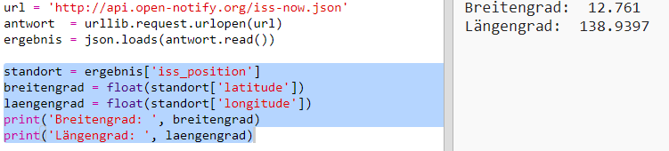
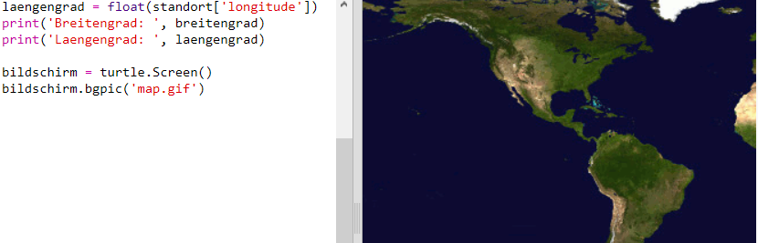
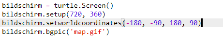

## Wo ist die ISS?

Die Internationale Weltraumstation befindet sich in der Erdumlaufbahn. Sie kreist ungefähr alle 1,5 Stunden um die Erde. Die ISS treibt mit einer durchschnittlichen Geschwindigkeit von 7,66 km pro Sekunde um die Erde. Das ist schnell! 

Lass uns einen anderen Web-Service benutzen, um herauszufinden, wo sich die ISS jetzt gerade befindet. 

+ Öffne als erstes das URL für den Web-Service in einem neuen Tab (Fenster) in deinem Web-Browser: <a href="http://api.open-notify.org/iss-now.json" target="_blank">http://api.open-notify.org/iss-now.json</a>
  
  Du solltest jetzt etwa Folgendes sehen können:
  
  ```
  {
  "iss_position" (Position der ISS): {
    "latitude" (Breitengrad): 8,54938193505081, 
    "longitude" (Längengrad): 73,16560793639105
  }, 
  "message" (Meldung): "success" (erfolgreich), 
  "timestamp" (Zeitstempel): 1461931913
  }
  ```
  
  Das Ergebnis enthält die Koordinaten des Standorts auf der Erde über dem die ISS gerade schwebt. 

  Der Längengrad ist die Ost-West Position und reicht von -180 bis 180. 0 ist der Null-Meridian, der durch Greenwich in London in Großbritannien läuft. 

  Der Breitengrad ist die Nord-Süd Position und läuft von 90 bis -90. 0 ist der Äquator. 

+ Jetzt musst du den gleichen Web-Service von Python aus aufrufen. Füge den folgenden Code zum Ende deines Scripts hinzu, um die aktuelle Position der ISS zu ermitteln:

  


+ Lass uns Variablen erstellen, um die Längengrade und Breitengrade zu speichern und diese dann ausdrucken:

  

+ Es wäre hilfreicher, die Position auf einer Karte, bzw. auf einem Atlas anzuzeigen.

  Als erstes müssen wir die Turtle Grafik Bibliothek importieren. 
  
  
  
+ Lass uns eine Weltkarte als Hintergrundbild laden: Es gibt bereits eine in deinem Trinket.

  
  
  NASA hat uns diese tolle Karte zu Verfügung gestellt und uns die Erlaubnis erteilt, diese Karte wieder zu benutzen. 
  
  Die Karte ist bei 0,0 zentriert, das ist genau das, was du brauchst. 

+ Du musst deine Bildschirmgröße einstellen, damit sie zur Bildgröße passt, welche 720 mal 360 ist. 

  Füge `screen.setup(720, 360)` (Bildschirmeinstellung (720, 360)) hinzu:

  
  
+ Du willst in der Lage sein, deine Schildkröte zu einem bestimmten Längen- und Breitengrad zu schicken. Um dies zu vereinfachen können wir den Bildschirm einstellen, damit er zu den Koordinaten passt, die wir benutzen:

   
  
  Jetzt passen die Koordinaten zu den Längen- und Breitengradkoordinaten, die wir vom Web-Service zurückerhalten haben. 

+ Lass uns jetzt eine Schildkröte für die ISS erstellen. 

  

  Dein Projekt enthält 'iss.png' und 'iss2.png', probiere beide mal aus und entscheide dich, welches davon du lieber magst. 

+ Die ISS startet in der Mitte der Karte, lass sie uns jetzt zur richtigen Position auf der Karte bringen:

  
  
  Beachte bitte, dass der Breitengrad normalerweise zuerst genannt wird, wir müssen hier jedoch zuerst den Längengrad angeben, wenn wir die Koordinaten (x,y) aufzeichnen. 

+ Teste dein Programm, indem du es laufen lässt.
Die ISS sollte sich jetzt zur aktuellen Position über der Erde bewegen. 
Warte ein paar Sekunden und lasse dann dein Programm noch einmal laufen, um zu sehen, wohin sich die ISS bewegt hat. 

  
