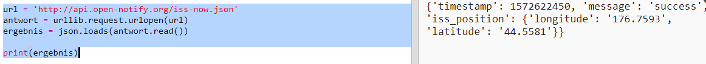

## Wo ist die ISS?

Die Internationale Raumstation befindet sich im Orbit um die Erde. Sie umrundet die Erde ungefähr alle anderthalb Stunden und erreicht eine Durchschnittsgeschwindigkeit von 7,66 km/s. Das ist schnell!

Verwenden wir einen anderen Web Service, um herauszufinden, wo sich die Internationale Raumstation befindet.

+ Öffne zunächst die URL für den Web Service in einem neuen Tab in deinem Webbrowser: <a href="http://api.open-notify.org/iss-now.json" target="_blank">http://api.open-notify.org/iss-now.json</a>

Du solltest so etwas sehen:

    {
    "iss_position": {
      "Breitengrad": 8.54938193505081, 
      "Laengengrad": 73.16560793639105
    }, 
    "message": "success", 
    "timestamp": 1461931913
    }
    

Das Ergebnis enthält die Koordinaten des Ortes auf der Erde, über dem die ISS sich derzeit befindet.

[[[generic-theory-lat-long]]]

+ Jetzt musst du denselben Web Service von Python aus aufrufen. Fügen den folgenden Code am Ende deines Skripts hinzu, um den aktuellen Standort der ISS zu ermitteln:

+ Erstellen wir Variablen, um Breitengrad und Längengrad zu speichern und dann auszugeben:

