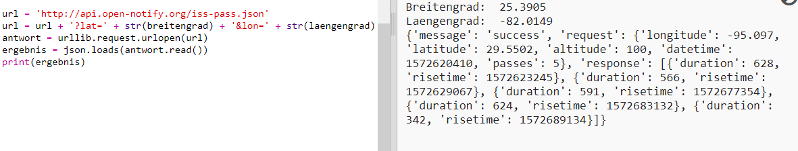

## Wann wird die ISS über uns sein?

Es gibt auch einen Web-Service, den du aufrufen kannst, um herauszufinden, wann sich die ISS das nächste Mal über einem bestimmten Standort befindet. 
Lass uns herausfinden, wann die ISS das nächste Mal über dem Space Centre in Houston, USA schweben wird, es hat einen Längengrad von 29,5502 und einen Breitengrad von 95,097.
  
+ Lass uns als erstes einen „dot“ auf die Karte mit diesen Koordinaten zeichnen:

  

+ Lass uns jetzt das Datum und die Uhrzeit herausfinden, wann die ISS das nächste Mal hierüber schwebt. 

  Wie zuvor auch, können wir den Web-Service aufrufen, indem wir  das URL in die Adressleiste des Browsers eingeben: <a href="http://api.open-notify.org/iss-pass.json" target="_blank">http://api.open-notify.org/iss-pass.json</a>
  
  Du solltest jetzt eine Fehlermeldung sehen:

  

+ Dieser Web-Service benutzt die Breiten- und Längengrade als Eingabe, wir müssen sie daher mit in das URL setzen, das wir benutzen.

  Die Eingabe wird nach einem `?` hinzugefügt und durch ein `&` getrennt. 

  Füge die `lat` (Breite) und `lon` (Länge) Eingaben wie folgt in das URL: <a href="http://api.open-notify.org/iss-pass.json?lat=29.55&lon=95.1"target="_blank">http://api.open-notify.org/iss-pass.json?lat=29.55&lon=95.1</a>
  
  
  
  Die Antwort enthält mehrere Überflugszeiten, wir betrachten hier die erste Zeitangabe. Die Zeit wird im Standard Zeitformat genannt. Du wirst in der Lage sein, dies in eine lesbare Zeit in Python zu konvertieren.

+  Lass uns jetzt den Web-Service von Python aus aufrufen. Füge den folgenden Code zum Ende deines Scripts hinzu:

  

+ Lass uns jetzt die erste Überflugszeit aus dem Ergebnis herausfinden.

Füge den folgenden Code hinzu:

  

+ Die Zeit wird als Zeitstempel genannt. Wir benötigen daher das Python Zeitmodul, damit wir die Zeit in lesbarer Form drucken können und sie zur Lokalzeit umwandeln können. Lass uns die Schildkröte nehmen, um die Überflugszeit beim „dot“ zu schreiben. 

+ Füge eine `import time` (Zeit importieren) Zeile oberhalb deines Scripts hinzu:

  

+ Die Funktion `time.cime()` wird die Zeit in eine lesbare Form umwandeln, die du mit der Schildkröte schreiben kannst: 

  
 
  (Du kannst die `print` (drucken) Zeile entfernen oder wegkommentieren.)
