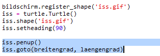
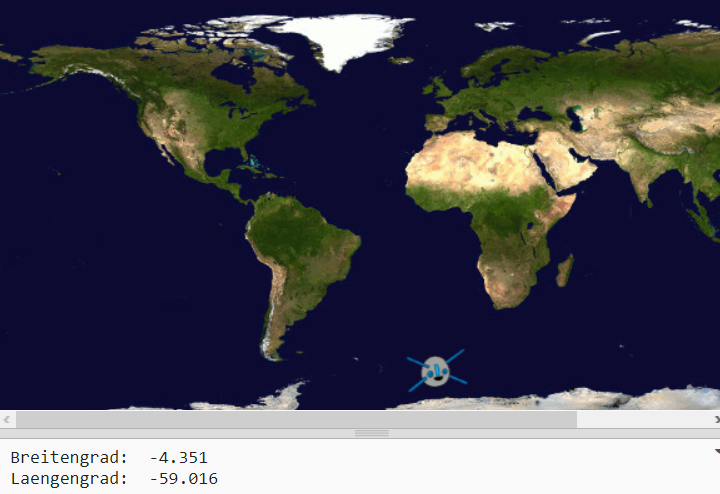

## Zeichne die ISS auf einer Karte

Es wäre nützlich, die Position auf einer Karte anzuzeigen. Du kannst dies mit Python Turtle Grafiken tun!

+ Zuerst müssen wir die `turtle` Python-Bibliothek importieren:

+ Als nächstes lädst du eine Weltkarte als Hintergrundbild. Es gibt bereits einen in deinem Trinket namens 'map.gif'! Die NASA hat diese schöne Karte und die Erlaubnis für die Wiederverwendung zur Verfügung gestellt. 

Die Karte ist zentriert bei `(0,0)` Breite und Länge - genau das, was du brauchst.

+ Du musst die Bildschirmgröße so einstellen, dass sie der Bildgröße von 720 x 360 Pixel entspricht. Füge `screen.setup(720, 360)` hinzu:

+ Du möchtest turtle an einen bestimmten Längen- und Breitengrad schicken können. Um dies zu vereinfachen, kannst du den Bildschirm so einstellen, dass er mit den von dir verwendeten Koordinaten übereinstimmt:

Jetzt stimmen die Koordinaten mit den Längen- und Breitengradkoordinaten überein, die du vom Web-Dienst zurückerhältst.

+ Erstellen wir ein Turtle-Symbol für die ISS. Dein Trinket enthält 'iss.gif' und 'iss2.gif' — probiere beide aus und schau, welches du bevorzugst. 

[[[generic-python-turtle-image]]]

--- hints ---
 --- hint ---

Dein Code sollte so aussehen:

--- /hint ---

--- /hints ---

+ Die ISS startet in der Mitte der Karte, jetzt bewegen wir sie an den richtigen Ort:

**Hinweis**: Breitengrad wird normalerweise zuerst angegeben, aber wir müssen zuerst den Längengrad angeben, wenn wir die `(x, y)` Koordinaten zeichnen.

+ Teste dein Programm, indem du es ausführst. Die ISS sollte sich an ihren aktuellen Standort oberhalb der Erde bewegen. 

+ Warte ein paar Sekunden und starte dein Programm erneut, um zu sehen, wohin die ISS gezogen ist.