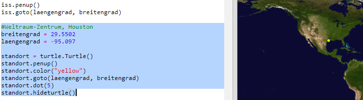
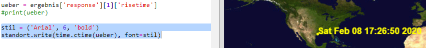

## Wann wird die ISS über dir sein?

Es gibt auch einen Webservice, mit dem du herausfinden kannst, wann die ISS das nächste Mal an einem bestimmten Ort sein wird.

Lass uns herausfinden, wann die ISS als nächstes das Raumfahrtzentrum in Houston, USA, überqueren wird, das sich auf Breitengrad `29.5502` und Längengrad `95.097` befindet.

+ Lass uns zunächst einen Punkt auf der Karte an diesen Koordinaten zeichnen:

Jetzt erhalten wir das Datum und die Zeit, in der die ISS sich das nächste Mal darüber befindet.

+ Wie bisher kannst du den Web Service aufrufen, indem du dessen URL in die Adressleiste eines Webbrowsers eingibst: <a href="http://api.open-notify.org/iss-pass.json" target="_blank">api.open-notify.org/iss-pass.json</a>

Du solltest einen Fehler sehen:

Dieser Web Service verwendet Breiten- und Längengrade als Eingaben, sodass wir diese in die URL aufnehmen müssen. Eingaben werden nach einem `?` hinzugefügt und mit `&` getrennt.

+ Füge die `Breitengrad` und `Längengrad` Angaben wie folgt in die URL ein: <a href="http://api.open-notify.org/iss-pass.json?lat=29.55&lon=95.1" target="_blank"> api.open-notify.org/iss-pass.json?lat=29.55&lon=95.1</a>

Die Antwort enthält mehrere Überflugzeiten, und wir werden uns nur die erste ansehen. Die Zeit wird als Unix-Zeitstempel angegeben (du kannst sie in eine lesbare Zeit in deinem Python-Skript konvertieren).

[[[generic-unix-timestamp]]]

+ Jetzt musst du denselben Web Service von Python aus aufrufen. Füge den folgenden Code am Ende deines Skripts hinzu:

+ Jetzt bekommen wir die erste Überflugzeit aus dem Ergebnis. Gib den folgenden Code ein:

Wir brauchen das Python `Zeit` Modul, damit wir es in einer lesbaren Form drucken und in lokale Zeit konvertieren können. Dann werden wir das Skript so ändern, dass die Überflugzeit für Houston ausgegeben wird.

+ Füge diese `import time` Zeile an den Anfang des Skripts hinzu:

+ Die ` time.ctime () ` Funktion konvertiert den Zeitstempel in eine lesbare Form, die du auf deine Karte schreiben kannst:

(Du kannst die `drucken` Zeile entfernen oder sie in einen Kommentar verwandeln, indem du `#` am Anfang hinzufügst, damit dein Skript sie ignoriert.)

+ Wenn du möchtest, kannst du die Farbe und das Format des Textes ändern. 

[[[generic-python-turtle-write]]]