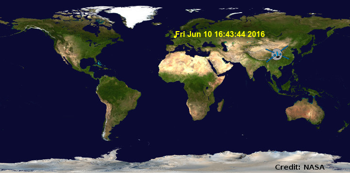

## Herausforderung: finde mehr Überflugzeiten

\--- challenge \---

Um die Breite und Länge eines Ortes zu suchen, an dem du interessiert bist, kannst du eine Website wie <a href="http://www.latlong.net/" target="_blank">www.latlong.net/</a> benutzen.

+ Kannst du die Überflugzeiten für weitere Standorte suchen und planen? 



\--- hints \--- \--- hint \---

Am Ende deines Programms setze die `Breiten-` und `Längengrad`-Variablen auf neue Werte und benutze dann die `Standort` Turtle-Variable, um einen Punkt an der neuen Stelle zu zeichnen. (Wähle eine andere Farbe, wenn du möchtest.) Rufe dann den `iss-pass` Web Service mit den Koordinaten auf (Du kannst den Code kopieren und einfügen, um dies zu tun). Abschließend erhältst du die `Anstiegszeit` aus der Antwort, und schreibst sie in das `Standort` Turtle.

\--- /hint \--- \--- hint \---

Füge diesen Code am Ende deines Programms hinzu und fülle die fehlenden Teile aus. Beachte, dass du den Code, den du geschrieben hast, kopieren und einfügen kannst, um die Überflugzeiten für das Raumfahrtzentrum in Houston zu erhalten und dann die Änderungen vornehmen kannst, die du benötigst.

```python
# Dein gewählter Standort
breitengrad = XX.XX
laengengrad = XX. X

# Zeichne einen Punkt mit der `Standort`-Turtle (du brauchst keine neue Turtle zu erstellen), wähle eine andere Farbe

# Erhalte das Ergebnis von `iss-pass.json` für deinen neuen Breitengrad und Längengrad

# Hol' dir die `risetime` aus dem Ergebnis und benutze die `Standort` Turtle, um sie auf die Karte zu schreiben
```

\--- /hint \--- \--- hint \---

Hier ist ein Beispiel mit der Lage des Baikonur Cosmodrom, einem Raumhafen im Süden Kasachstans. Der Code wird am Ende deines Programms angezeigt, nachdem du die Überflugzeit vom Houston Raumfahrtzentrum aufgezeichnet hast.

```python
# Baikonur Cosmodrome
breitengrad = 45.86
laengengrad = 63.31

standort.penup()
standort.color('orange')
standort.goto(laengengrad, breitengrad)
standort.dot(5)
standort.hideturtle()

url = 'http://api.open-notify.org/iss-pass. son?lat=' + str(breitengrad) + '&lon=' + str(laengengrad)
antwort = urllib.request.urlopen(url)
ergebnis = json.loads(reply).read()

#print(ergebnis)
ueber = ergebnis['response'][1]['risetime']
standort.write(time.ctime(ueber))
```

Versuche weitere Orte hinzuzufügen!

\--- /hint \--- \--- /hints \--- \--- /challenge \---