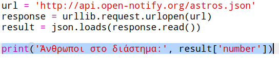
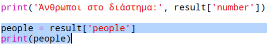
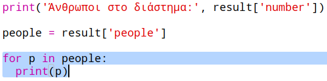
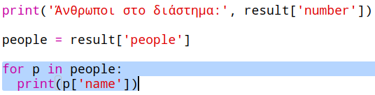

## Ποιος είναι στο διάστημα;

Θα χρησιμοποιήσεις μια υπηρεσία web που παρέχει πληροφορίες για το διάστημα σε πραγματικό χρόνο. Πρώτα, ας μάθουμε ποιος είναι τώρα στο διάστημα.

Μια υπηρεσία ιστού (web service) έχει μια διεύθυνση (URL) όπως ακριβώς και ένας δικτυακός τόπος. Αντί ωστόσο να επιστρέφει κώδικα HTML για μια ιστοσελίδα, επιστρέφει δεδομένα.

+ Άνοιξε <a href="http://api.open-notify.org/astros.json" target="_blank">την υπηρεσία web</a> σε ένα πρόγραμμα περιήγησης.

Θα πρέπει να δεις κάτι σαν κι αυτό:

    {
      "message": "success",
      "number": 3,
      "people": [
        {
          "craft": "ISS",
          "name": "Yuri Malenchenko"
        },
        {
          "craft": "ISS",
          "name": "Timothy Kopra"
        },
        {
          "craft": "ISS",
          "name": "Timothy Peake"
        }
      ]
    }
    

Τα δεδομένα είναι ζωντανά, επομένως πιθανότατα θα δεις ένα ελαφρώς διαφορετικό αποτέλεσμα. Η μορφή δεδομένων ονομάζεται `JSON` (προφέρεται 'Jason').

[[[generic-json]]]

Πρέπει να καλέσεις την υπηρεσία web από ένα μικρό πρόγραμμα (script) Python, ώστε να μπορείς να χρησιμοποιήσεις τα αποτελέσματα.

+ Άνοιξε αυτό το πρότυπο trinket: <http://rpf.io/iss-on>{:target="_blank"}.

Οι βιβλιοθήκες `urllib.request` και `json` έχουν ήδη εισαχθεί στην αρχή του προγράμματος `main.py`.

+ Πρόσθεσε τον ακόλουθο κώδικα στο `main.py` για να αποθηκεύσεις σε μια μεταβλητή τη διεύθυνση URL της υπηρεσίας web που μόλις άνοιξες:

+ Τώρα κάλεσε την υπηρεσία web:

+ Στη συνέχεια θα πρέπει να φορτώσεις τα JSON δεδομένα σε μια δομή δεδομένων Python:

Θα πρέπει να δεις κάτι σαν κι αυτό:

    {'message': 'success', 'number': 3, 'people': [{'craft': 'ISS', 'name': 'Yuri Malenchenko'}, {'craft': 'ISS', 'name': 'Timothy Kopra'}, {'craft': 'ISS', 'name': 'Timothy Peake'}]}
    

Αυτό είναι ένα λεξικό Python με τρία κλειδιά: `message` , `number` και `people` .

[[[generic-python-key-value-pairs]]]

Η τιμή `success` για το κλειδί `message` σε ενημερώνει ότι το άνοιγμα της υπηρεσίας πέτυχε. Σημείωσε ότι θα δεις διαφορετικές τιμές για τα κλειδιά `number` και `people` ανάλογα με το πόσοι και ποιοι βρίσκονται τώρα στο διάστημα.

Ας εμφανίσουμε τώρα τις πληροφορίες με πιο ευανάγνωστο τρόπο.

+ Αρχικά, ας εμφανίσουμε τον αριθμό των ανθρώπων που βρίσκονται τώρα στο διάστημα:

Η `result['number']` θα εμφανίσει την τιμή που σχετίζεται με το κλειδί `number` στο λεξικό `result`. Στο παράδειγμα, ο αριθμός είναι `3`.

+ Η τιμή που σχετίζεται με το κλειδί `people` είναι μια λίστα λεξικών! Ας την καταχωρήσουμε σε μια μεταβλητή ώστε να μπορείς να τη χρησιμοποιήσεις:

Θα πρέπει να δεις κάτι σαν κι αυτό:

    [{'craft': 'ISS', 'name': 'Yuri Malenchenko'}, {'craft': 'ISS', 'name': 'Timothy Kopra'}, {'craft': 'ISS', 'name': 'Timothy Peake'}]
    

+ Τώρα πρέπει να εμφανίσεις κάθε αστροναύτη σε διαφορετική γραμμή. Χρησιμοποίησε ένα βρόχο `for` για να το κάνεις.

[[[generic-python-for-loop-list]]]

+ Σε κάθε επανάληψη, το `p` θα περιέχει ένα λεξικό για διαφορετικό αστροναύτη.

+ Μπορείς στη συνέχεια να βρίσκεις τις τιμές για τα κλειδιά `name` και `craft`. Ας εμφανίσουμε τα ονόματα των ανθρώπων στο διάστημα:

Θα πρέπει να δεις κάτι σαν κι αυτό:

    Άνθρωποι στο διάστημα:  3
    Yuri Malenchenko
    Timothy Kopra
    Timothy Peake
    

**Σημείωση:** Χρησιμοποιείς πραγματικά δεδομένα, γι'αυτό τα αποτελέσματα εξαρτώνται από τον αριθμό των ανθρώπων στο διάστημα τη συγκεκριμένη στιγμή.