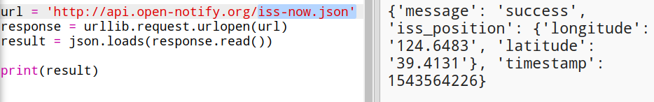
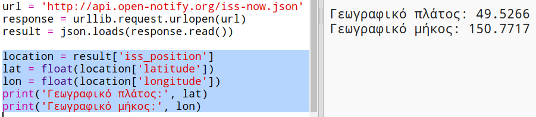

## Πού είναι o ISS;

Ο Διεθνής Διαστημικός Σταθμός βρίσκεται σε τροχιά γύρω από τη Γη. Συμπληρώνει μια τροχιά γύρω από τη γη περίπου κάθε μιάμιση ώρα και ταξιδεύει με μέση ταχύτητα 7,66 χλμ. το δευτερόλεπτο. Πάει σφαίρα!

Ας χρησιμοποιήσουμε μια άλλη υπηρεσία web για να μάθεις πού είναι ο Διεθνής Διαστημικός Σταθμός.

+ Άνοιξε πρώτα τη διεύθυνση URL για την υπηρεσία web σε μια νέα καρτέλα στο πρόγραμμα περιήγησης: <a href="http://api.open-notify.org/iss-now.json" target="_blank">http://api.open-notify.org/iss-now.json</a>

Θα πρέπει να δεις κάτι σαν κι αυτό:

    {
    "iss_position": {
      "latitude": 8.54938193505081, 
      "longitude": 73.16560793639105
    }, 
    "message": "success", 
    "timestamp": 1461931913
    }
    

Το αποτέλεσμα περιέχει τις γεωγραφικές συντεταγμένες του σημείου στη Γη, πάνω από το οποίο βρίσκεται ο ISS.

[[[generic-theory-lat-long]]]

+ Τώρα πρέπει να καλέσεις την ίδια υπηρεσία web στο πρόγραμμά σου στην Python. Πρόσθεσε τον ακόλουθο κώδικα στο τέλος του σεναρίου σου για να λάβεις την τρέχουσα θέση του ISS:

+ Ας δημιουργήσουμε μεταβλητές για να αποθηκεύσουμε το γεωγραφικό πλάτος και μήκος και στη συνέχεια να τις εμφανίσουμε:

