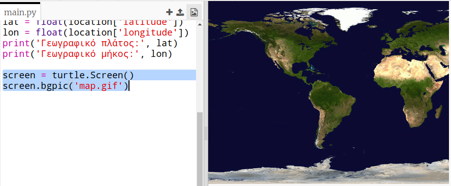
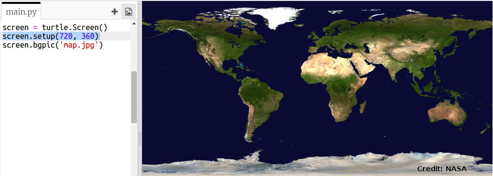
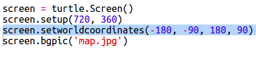
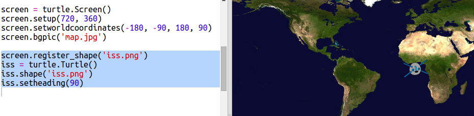
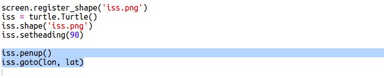

## Αποτύπωση του ISS σε χάρτη

Θα ήταν χρήσιμο να δείξεις τη θέση του ISS σε ένα χάρτη. Μπορείτε να το κάνετε αυτό χρησιμοποιώντας τα γραφικά της Python Turtle!

+ Πρώτα θα χρειαστεί να εισάγεις την βιβλιοθήκη `turtle` της Python:

+ Έπειτα, φορτώνεις ένα παγκόσμιο χάρτη ως εικόνα φόντου. There’s one already included in your trinket called 'map.gif'! Η NASA έχει παράσχει αυτόν τον όμορφο χάρτη με άδεια επαναχρησιμοποίησης. 

To κέντρο του χάρτη είναι στο `(0,0)` γεωγραφικού πλάτους και γεωγραφικού μήκους, ακριβώς αυτό που χρειάζεσαι.

+ Πρέπει να ρυθμίσεις το μέγεθος της οθόνης ώστε να ταιριάζει με το μέγεθος της εικόνας, το οποίο είναι 720Χ360 pixel. Πρόσθεσε το `screen.setup (720, 360)`:

+ Χρειάζεται να μετακινείς τη χελώνα σε ένα συγκεκριμένο γεωγραφικό πλάτος και μήκος. Για να γίνει αυτό εύκολα, μπορείς να ρυθμίσεις την οθόνη ώστε να ταιριάζει με τις συντεταγμένες που χρησιμοποιείς:

Τώρα οι συντεταγμένες θα αντιστοιχούν στο γεωγραφικό πλάτος και μήκος που επιστρέφει η υπηρεσία web.

+ Ας δημιουργήσουμε ένα εικονίδιο χελώνας για τον ISS. Your trinket includes 'iss.gif' and 'iss2.gif' — try them both and see which one you prefer. 

[[[generic-python-turtle-image]]]

\--- hints \--- \--- hint \---

Ο κώδικας θα πρέπει να μοιάζει κάπως έτσι:

\--- /hint \--- \--- /hints \---

+ Ο ISS ξεκινά από το κέντρο του χάρτη. Ας τον μετακινήσουμε τώρα στη σωστή θέση:

**Σημείωση**: το γεωγραφικό πλάτος κανονικά δίνεται πρώτα, αλλά πρέπει να δώσουμε το γεωγραφικό μήκος πρώτα κατά την αποτύπωση των συντεταγμένων `(x, y)`.

+ Δοκίμασε να εκτελέσεις το πρόγραμμά σου. Ο ISS θα πρέπει να μετακινηθεί στην τρέχουσα θέση του πάνω από τη Γη. 

+ Περίμενε μερικά δευτερόλεπτα και εκτέλεσε ξανά το πρόγραμμά σου για να δεις προς τα που μετακινήθηκε ο ISS.