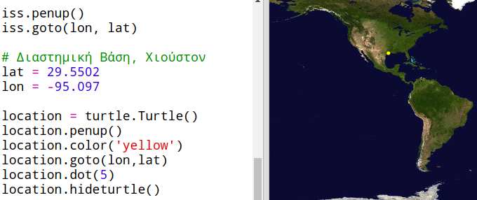
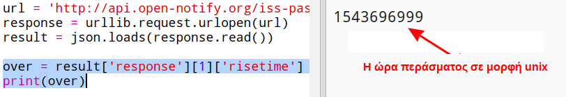
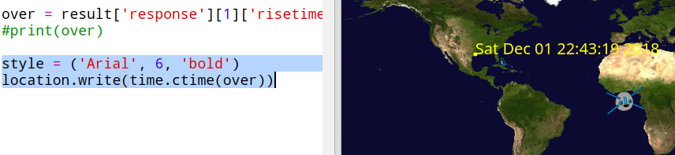

## Πότε o ISS θα βρίσκεται από πάνω μας;

Υπάρχει ακόμη μία υπηρεσία web που μπορείς να χρησιμοποιήσεις για να μάθεις πότε ο ISS θα βρίσκεται πάνω από μια συγκεκριμένη τοποθεσία.

Ας δούμε πότε θα είναι η αμέσως επόμενη διέλευση του ISS πάνω από τη Διαστημική Βάση στο Χιούστον των ΗΠΑ, το οποίο βρίσκεται σε γεωγραφικό πλάτος `29.5502` και γεωγραφικό μήκος `95.097`.

+ Πρώτα ας σχεδιάσουμε μια κουκίδα στο χάρτη σε αυτές τις συντεταγμένες:

Τώρα ας πάρουμε την προσεχή ημερομηνία και ώρα που o ISS θα βρίσκεται πάνω από το Χιούστον.

+ Όπως και πριν, μπορείς να καλέσεις την υπηρεσία web εισάγοντας τη διεύθυνση URL στη γραμμή διευθύνσεων ενός προγράμματος περιήγησης: <api.open-notify.org/iss-pass.json</a>

Θα πρέπει να δεις ένα μήνυμα σφάλματος:

Αυτή η υπηρεσία web δέχεται ως δεδομένα το γεωγραφικό πλάτος και μήκος, επομένως πρέπει να τα συμπεριλάβεις στη διεύθυνση URL. Δεδομένα εισόδου γράφονται μετά από ένα `?` και διαχωρίζονται με `&`.

+ Πρόσθεσε τα δεδομένα `lat` και `lon` στη διεύθυνση url όπως παρακάτω: <a href="http://api.open-notify.org/iss-pass.json?lat=29.55&lon=95.1" target="_blank">api.open-notify.org/iss-pass.json?lat=29.55&lon=95.1</a>

Το αποτέλεσμα περιλαμβάνει αρκετά περάσματα του ISS πάνω από τη διαστημική βάση. Μας ενδιαφέρει απλά το πρώτο πέρασμα. Η ώρα δίνεται σε μορφή Unix (θα την μετατρέψεις στη σωστή μορφή στο σενάριο Python).

[[[generic-unix-timestamp]]]

+ Τώρα ας καλέσουμε την υπηρεσία web από την Python. Πρόσθεσε τον ακόλουθο κώδικα στο τέλος του σεναρίου:

+ Τώρα ας πάρουμε την ώρα του πρώτου περάσματος από το αποτέλεσμα. Πρόσθεσε τον ακόλουθο κώδικα:

Θα χρειαστείς τη βιβλιοθήκη `time` της Python έτσι ώστε να μπορέσεις να την εμφανίσεις σε μια ευανάγνωστη μορφή και να την μετατρέψεις σε τοπική ώρα. Έπειτα θα προσθέσεις κώδικα για να εμφανίσεις την ώρα δίπλα στην κουκίδα για το Χιούστον στο χάρτη.

+ Πρόσθεσε τη γραμμή `import time` στην κορυφή του σεναρίου:

+ Η συνάρτηση `time.ctime()` θα μετατρέψει την ώρα από μορφή Unix σε ευανάγνωστη μορφή που μπορείς να γράψεις στον χάρτη σου:

(Μπορείς να διαγράψεις την γραμμή `print` ή να την μετατρέψεις σε σχόλιο προσθέτοντας στην αρχή της `#` έτσι ώστε το σενάριο να την αγνοήσει.)

+ Αν θέλεις, μπορείς να αλλάξεις το χρώμα και τη μορφή του κειμένου. 

[[[generic-python-turtle-write]]]