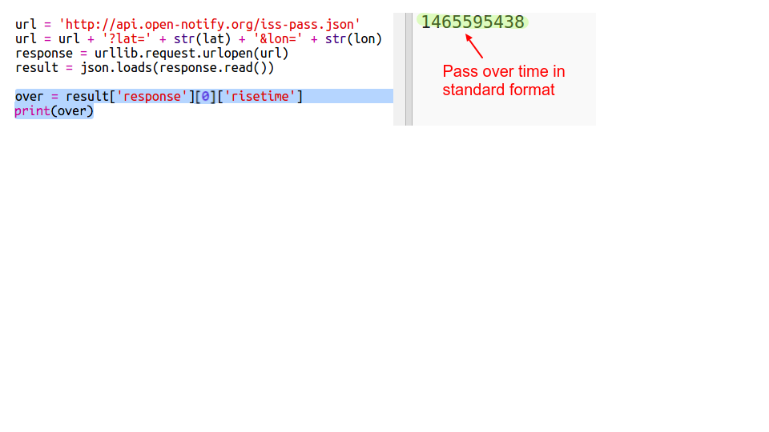

## When will the ISS be overhead?

There’s also a web service that you can use to find out when the ISS will next be over a particular location. 

Let’s find out when the ISS will next be over the Space Centre in Houston, USA, which is at latitude `29.5502` and longitude `95.097`.
  
+ First let’s plot a dot on the map at these coordinates:

Now let’s get the date and time that the ISS is next overhead.

+ As before, you can call the web service by entering its URL into the address bar of a web browser: <a href="http://api.open-notify.org/iss-pass.json" target="_blank">api.open-notify.org/iss-pass.json</a>

You should see an error:

This web service takes latitude and longitude as inputs, so you have to include them in the URL. Inputs are added after a `?` and separated with `&`. 

+ Add the `lat` and `lon` inputs to the url as shown: <a href="http://api.open-notify.org/iss-pass.json?lat=29.55&lon=95.1" target="_blank">api.open-notify.org/iss-pass.json?lat=29.55&lon=95.1</a>
  

  
The response includes several pass-over times, and we’ll just look at the first one. The time is given as a Unix time stamp  (you'll be able to convert it to a readable time in your Python script).
    
[[[generic-unix-timestamp]]]

+ Now let's call the web service from Python. Add the following code to the end of your script:

+ Now let's get the first pass over time from the result. Add the following code:

We’ll need the Python `time` module so we can print it in a readable form and convert it to local time. Then we'll get the script to write the pass-over time by the dot for Houston. 

+ Add an `import time` line at the top of your script:

+ The `time.ctime()` function will convert the time stamp to a readable form that you can write onto your map:

 
(You can remove the `print` line, or turn it into a comment by adding `#` at the start so your script will ignore it.)
    
+ If you like, you can change the colour and format of the text. 

[[[generic-python-turtle-write]]] 
