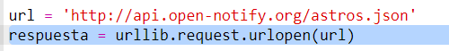
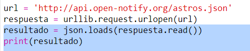
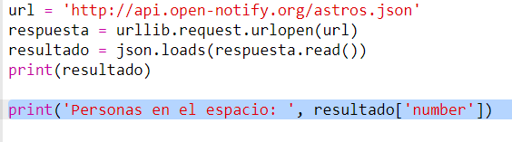

## ¿Quién está en el espacio?

Vas a usar un servicio web que proporciona información del espacio en directo. En primer lugar, averigüemos quién se encuentra actualmente en el espacio. 

+ Un servicio web tiene una dirección (url) al igual que una página web. En lugar de devolver HTML para una página web, devuelve datos. 

Abre <a href="http://api.open-notify.org/astros.json" target="_blank">http://api.open-notify.org/astros.json</a> en un navegador web. 

Deberías ver algo similar a esto:

```
{
  "message": "success", 
  "number": 3, 
  "people": [
    {
      "craft": "ISS", 
      "name": "Yuri Malenchenko"
    }, 
    {
      "craft": "ISS", 
      "name": "Timothy Kopra"
    }, 
    {
      "craft": "ISS", 
      "name": "Timothy Peake"
    }
  ]
}
```

Los datos se proporcionan en directo, por lo que cambiarán constantemente. El formato se denomina JSON (pronunciado Jason). 

+ Realicemos una llamada al servicio web desde Python para usar los resultados.

  Abre este trinket: <a href="http://jumpto.cc/iss-go" target="_blank">jumpto.cc/iss-go</a>. 

+ Los módulos `urllib.request` y `json` ya han sido importados. 

  Añade el siguiente código a `main.py` para agregar la dirección web que acabas de usar a una variable:

  
   
+ A continuación, llamemos al servicio web:

  


+ Ahora necesitarás cargar la respuesta de JSON en una estructura de datos Python:

  


Deberías ver algo similar a esto:

```
{'message': 'success', 'number': 3, 'people': [{'craft': 'ISS', 'name': 'Yuri Malenchenko'}, {'craft': 'ISS', 'name': 'Timothy Kopra'}, {'craft': 'ISS', 'name': 'Timothy Peake'}]}
```

Este es un diccionario Python con 3 claves: mensaje, número y personas. 

El valor 'success' del mensaje te indica que la solicitud ha tenido éxito. Bien. 

¡Ten en cuenta que verás resultados distintos en función de quién se encuentra actualmente en el espacio!

+ Ahora, imprimamos la información de modo más sencillo de leer. 

  En primer lugar, comprobemos cuántas personas hay en el espacio e imprimamos dicha información:
  
  

  `result['number']` imprimirá el valor asociado a la clave 'number' en el diccionario resultante. En este ejemplo es `3`. 

+ ¡El valor asociado con la clave 'people' es una lista de diccionarios! Pongamos dicho valor a una variable de modo que podamos usarla:

  


Deberías ver algo similar a esto: 
```
[{'craft': 'ISS', 'name': 'Yuri Malenchenko'}, {'craft': 'ISS', 'name': 'Timothy Kopra'}, {'craft': 'ISS', 'name': 'Timothy Peake'}]
```

+ A continuación, tienes que imprimir una línea para cada astronauta.

  Puedes usar un bucle 'for' para hacerlo en Python. En cada ciclo del bucle, `p` se establecerá en un diccionario para un astronauta distinto.

  

+ Luego podrás buscar los valores de 'name' y 'craft'.

  
  
  Deberías ver algo similar a:

  ```
  Personas en el espacio:  3
  Yuri Malenchenko
  Timothy Kopra
  Timothy Peake
  ```

  Estás usando datos en directo, por lo tanto, tus resultados variarán en función del número de personas que haya en el espacio en esos momentos. 
