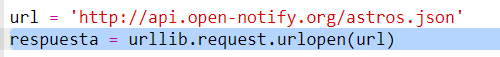
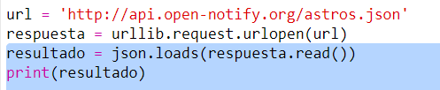
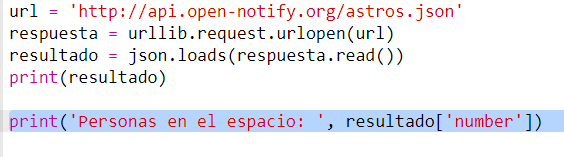
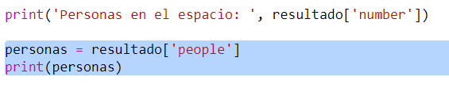
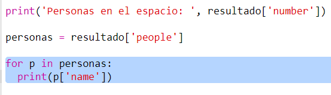

## ¿Quién está en el espacio?

Vas a utilizar un servicio web que proporciona información en directo sobre el espacio. En primer lugar, veamos quién está actualmente en el espacio.

Un servicio web tiene una dirección (URL) al igual que un sitio web. En lugar de devolver HTML para una página web, este devuelve datos.

+ Abre <a href="http://api.open-notify.org/astros.json" target="_blank">el servicio web</a> en un navegador web.

Deberás ver algo como esto:
```
    {
      "message": "success",
      "number": 3,
      "people": [
        {
          "craft": "ISS",
          "name": "Yuri Malenchenko"
        },
        {
          "craft": "ISS",
          "name": "Timothy Kopra"
        },
        {
          "craft": "ISS",
          "name": "Timothy Peake"
        }
      ]
    }
```    

Los datos están en vivo, por lo que probablemente verás un resultado ligeramente diferente. El formato de los datos se llama `JSON` (pronunciado como 'Jason').

[[[generic-json]]]

Debes llamar al servicio web desde un código de Python para poder usar los resultados.

+ Abre este trinket: <http://rpf.io/iss-on>{:target="_blank"}.

Los módulos `urllib.request` y `json` ya han sido importados para ti en la parte superior del script `main.py`.

+ Agrega el siguiente código a `main.py` para almacenar la URL del servicio web al que acabas de acceder como una variable:


+ Ahora llama al servicio web:



+ A continuación, debes cargar la respuesta JSON en una estructura de datos de Python:



Deberás ver algo como esto:
```
    {'message': 'success', 'number': 3, 'people': [{'craft': 'ISS', 'name': 'Yuri Malenchenko'}, {'craft': 'ISS', 'name': 'Timothy Kopra'}, {'craft': 'ISS', 'name': 'Timothy Peake'}]}
```    

Este es un diccionario Python con tres claves: `message`, `number` y `people`.

[[[generic-python-key-value-pairs]]]

Que `message` tenga como valor `success` te dice que accediste correctamente al servicio web. Ten en cuenta que verás diferentes resultados para `number` y `people` dependiendo de quién esté actualmente en el espacio.

Ahora imprimiremos la información de una manera más legible.

+ Primero busquemos el número de personas en el espacio e imprimámoslo:



`resultado['number']` imprimirá el valor asociado con la clave `number` en el diccionario `resultado`. En el ejemplo esto es `3`.

+ El valor asociado con la clave `people` ¡ es una lista de diccionarios! Pongamos ese valor en una variable para que puedas usarlo:



Deberás ver algo como esto:
```
    [{'craft': 'ISS', 'name': 'Yuri Malenchenko'}, {'craft': 'ISS', 'name': 'Timothy Kopra'}, {'craft': 'ISS', 'name': 'Timothy Peake'}]
```    

+ Ahora necesitas imprimir una línea por cada astronauta. En Python puede usar un bucle `for` para hacer esto.

[[[generic-python-for-loop-list]]]

+ Cada vez que se ejecuta el bucle, `p` tomará el valor de un diccionario para un astronauta diferente.



+ A continuación, puedes buscar los valores para `name` y `craft`. Mostremos los nombres de las personas en el espacio:


Deberás ver algo como esto:
```
    Personas en el espacio: 3
    Yuri Malenchenko
    Timothy Kopra
    Timothy Peake
```    

**Nota:** Estás utilizando datos en vivo, por lo que tus resultados dependerán de la cantidad de personas que actualmente estén en el espacio.