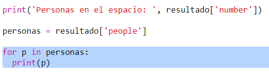

## Reto: Mostrar la nave

Va a utilizar un servicio web que proporciona información en directo sobre el espacio. En primer lugar, veamos quién está actualmente en el espacio.

Un servicio web tiene una dirección (URL) al igual que un sitio web. En lugar de devolver HTML para una página web, devuelve datos.

+ Abra <a href="http://api.open-notify.org/astros.json" target="_blank"> el servicio web </a> en un navegador web.

Deberá ver algo como esto:

    {
      "message": "success",
      "number": 3,
      "people": [
        {
          "craft": "ISS",
          "name": "Yuri Malenchenko"
        },
        {
          "craft": "ISS",
          "name": "Timothy Kopra"
        },
        {
          "craft": "ISS",
          "name": "Timothy Peake"
        }
      ]
    }
    

Los datos están en vivo, por lo que probablemente verá un resultado ligeramente diferente. El formato de los datos se llama ` JSON. ` (pronunciado como 'Jason').

[[[generic-json]]]

Debe llamar al servicio web desde un script de Python, para poder usar los resultados.

+ Abra esta baratija: [ http://rpf.io/iss-on ](http://rpf.io/iss-on) {: target = "_ blank"}.

Los módulos `urllib.request` y `json` ya han sido importados para usted en la parte superior del script `main.py`.

+ Agregue el siguiente código a ` main.py ` para almacenar la URL del servicio web al que acaba de acceder como variable:

+ Ahora llame al servicio web:

+ A continuación, debe cargar la respuesta JSON en una estructura de datos de Python:

Deberá ver algo como esto:

    {'message': 'success', 'number': 3, 'people': [{'craft': 'ISS', 'name': 'Yuri Malenchenko'}, {'craft': 'ISS', 'name': 'Timothy Kopra'}, {'craft': 'ISS', 'name': 'Timothy Peake'}]}
    

Este es un diccionario Python con tres claves: `message`, `number`, y `people`.

[[[generic-python-key-value-pairs]]]

Que `message` tiene el valor `success` le dice que accedió correctamente al servicio web. Tenga en cuenta que verá diferentes resultados para `number` y `people` dependiendo de quién esté actualmente en el espacio.

Ahora imprimiremos la información de una manera más legible.

+ Primero, busquemos el número de personas en el espacio e imprimámoslo:

`resultado['number']` imprimirá el valor asociado con la clave `number` en el diccionario `resultado`. En el ejemplo, esto es `3`.

+ El valor asociado con la clave `people` es una lista de diccionarios! Pongamos ese valor en una variable para que pueda usarlo:

Deberá ver algo como esto:

    [{'craft': 'ISS', 'name': 'Yuri Malenchenko'}, {'craft': 'ISS', 'name': 'Timothy Kopra'}, {'craft': 'ISS', 'name': 'Timothy Peake'}]
    

+ Ahora necesita imprimir una línea para cada astronauta. En Python puede usar un bucle `for` para hacer esto.

[[[generic-python-for-loop-list]]]

+ Cada vez que se ejecuta el bucle, ` p ` tomará el valor de un diccionario para un astronauta diferente.

+ You can then look up the values for `name` and `craft`. Mostremos los nombres de las personas en el espacio:

Deberá ver algo como esto:

    Personas en el espacio: 3
    Yuri Malenchenko
    Timothy Kopra
    Timothy Peake
    

** Nota: ** Está utilizando datos en vivo, por lo que sus resultados dependerán de la cantidad de personas que actualmente estén en el espacio.