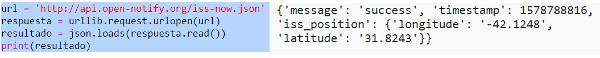
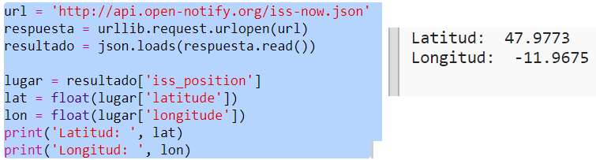
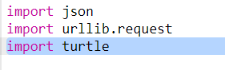
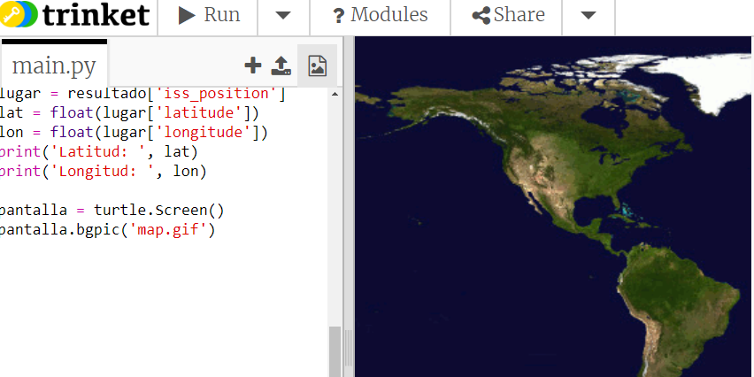
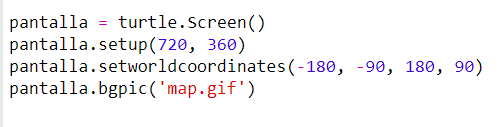

## ¿Dónde está la ISS?

La Estación Espacial Internacional gira alrededor de la Tierra. Gira alrededor de la Tierra aproximadamente cada hora y media. La ISS viaja a una velocidad media de 7,66 km por segundo. ¡Eso sí que es velocidad! 

Usemos otro servicio web para averiguar dónde se encuentra la Estación Espacial Internacional. 

+ En primer lugar, abre la url del servicio web en una nueva ficha de tu navegador web: <a href="http://api.open-notify.org/iss-now.json" target="_blank">http://api.open-notify.org/iss-now.json</a>
  
  Deberías ver algo similar a esto:
  
  ```
  {
  "iss_position": {
    "latitude": 8.54938193505081, 
    "longitude": 73.16560793639105
  }, 
  "message": "success", 
  "timestamp": 1461931913
  }
  ```
  
  El resultado contiene las coordenadas del punto terrestre sobre el que se encuentra actualmente la ISS. 

  La longitud es la posición este-oeste y va de -180 a 180. 0 es el meridiano principal que pasa por Greenwich en Londres, RU.  

  La latitud es la posición norte-sur y va de 90 a -90. 0 es el ecuador. 

+ Ahora debes recuperar el mismo servicio web desde Python. Añade el siguiente código al final de tu script para obtener la ubicación actual de la ISS:

  


+ Crea variables para almacenar la latitud y la longitud e imprímelas:

  

+ Resultará más útil mostrar la posición en un mapa.

  En primer lugar, necesitaremos importar la biblioteca de gráficas tortuga. 
  
  
  
+ Carguemos un mapa del mundo como imagen de fondo. Ya tienes uno incluido en tu trinket.

  
  
  NASA ha proporcionado este estupendo mapa y otorgado permiso para reutilizarlo. 
  
  El mapa está centrado en 0,0 exactamente como necesitas. 

+ Debes establecer el tamaño de la pantalla de modo que coincida con el tamaño de la imagen, que es 720 por 360. 

  Añade `screen.setup(720, 360)`:

  
  
+ Debes ser capaz de enviar la tortuga a una latitud y longitud concretas. Para facilitarlo, podemos establecer la pantalla de modo que coincida con las coordenadas que estamos usando:

   
  
  Ahora, las coordenadas coincidirán con las coordenadas de la latitud y longitud que obtengamos del servicio web. 

+ Creemos una tortuga para la ISS. 

  

  Tu proyecto incluye 'iss.png' e 'iss2.png'. Probemos ambas para ver cuál prefieres. 

+ La ISS comienza en el centro del mapa. Movámosla a la ubicación correcta del mapa:

  
  
  Ten en cuenta que, por norma general, la latitud se proporciona primero. Sin embargo, al trazar las coordenadas (x, y), debemos proporcionar primero la longitud. 

+ Probemos el programa ejecutándolo.
La ISS debería moverse a su ubicación actual sobre la Tierra. 
Espera unos segundos y vuelve a ejecutar el programa para ver cómo se ha movido la ISS: 

  
