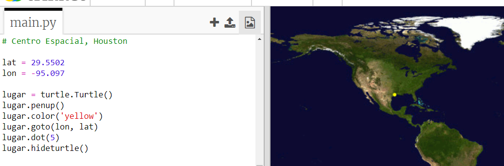
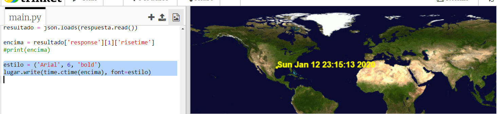

## ¿Cuándo pasará por encima la ISS?

Existe igualmente un servicio web que puedes usar para averiguar cuándo la ISS pasará sobre una ubicación concreta. 
Averigüemos cuándo la ISS pasará sobre el Centro Espacial de Houston, EE. UU., cuya latitud es 29.5502 y longitud = 95.097.
  
+ En primer lugar, tracemos un punto en el mapa en estas coordenadas:

  

+ A continuación, obtengamos la fecha y la hora en la que la ISS volverá a pasar sobre está ubicación. 

  Al igual que antes, podemos contactar con el servicio web introduciendo la url en la barra de dirección del navegador web: <a href="http://api.open-notify.org/iss-pass.json" target="_blank">http://api.open-notify.org/iss-pass.json</a>
  
  Deberías ver un error:

  

+ Este servicio web toma la latitud y la longitud como entradas, por lo que debemos incluirlas en la url que usemos.

  Las entradas se añaden después de un `?` y se separan mediante `&`. 

  Añade las entradas `lat` y `lon` a la url tal y como se muestra: <a href="http://api.open-notify.org/iss-pass.json?lat=29.55&lon=95.1"target="_blank">http://api.open-notify.org/iss-pass.json?lat=29.55&lon=95.1</a>
  
  
  
  La respuesta incluye varios sobrevuelos a distintas horas. Solamente miraremos el primero. La hora se indica en formato horario estándar. Serás capaz de convertirla a una hora que pueda leerse en Python. 

+ A continuación, contactemos con el servicio web desde Python. Añade el siguiente código al final de tu script:

  

+ Ahora, usemos el primer sobrevuelo de los resultados.

Añade el siguiente código:

  

+ La hora se proporciona como marca horaria, por lo que necesitaremos el módulo horario de Python para poder imprimirla en un formato que podamos leer y convertir a la hora local.  Hagamos que la tortuga escriba la hora de sobrevuelo al lado del punto. 

+ Añade una linea `import time` a la parte superior de tu script:

  

+ La función `time.cime()` convertirá la hora a un formato que podamos leer y escribir con la tortuga: 

  
 
  (Puedes eliminar o comentar la línea `print`).
