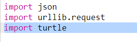
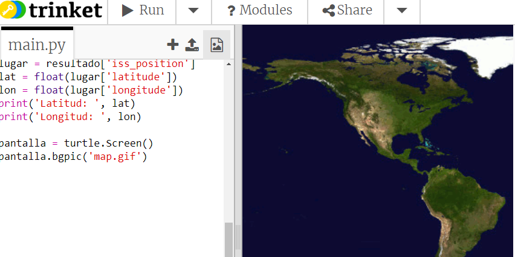
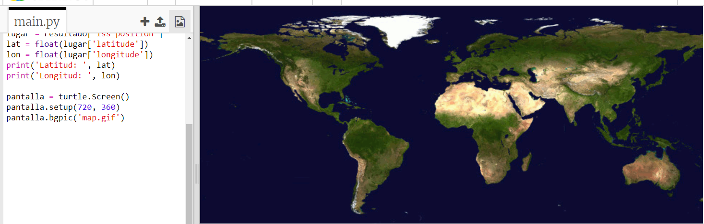
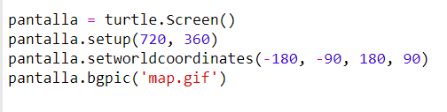
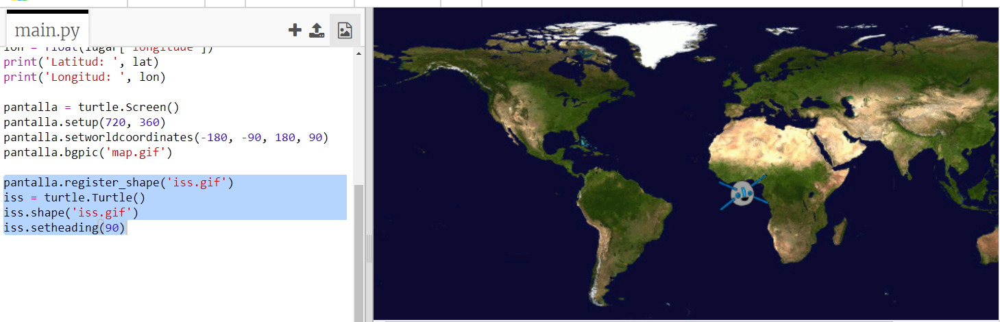
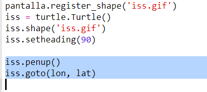
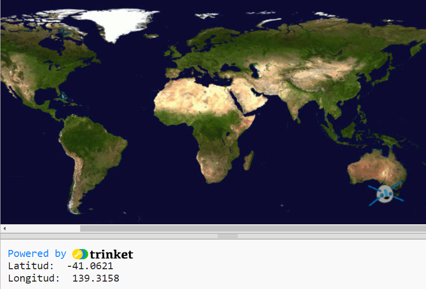

## Trazando la ISS en un mapa

Sería útil mostrar la posición en un mapa. ¡Puedes hacer esto utilizando el módulo Turtle para gráficos de Python!

+ En primer lugar tendremos que importar el módulo `turtle` de Python:

+ A continuación, carga un mapa del mundo como imagen de fondo. ¡Ya hay uno incluido en tu trinket llamado 'map.gif'! La NASA ha proporcionado este hermoso mapa y ha dado permiso para su reutilización. 

El mapa está centrado en latitud y longitud `(0,0)`, que es justo lo que necesitamos.

+ Debes configurar el tamaño de la pantalla para que coincida con el tamaño de la imagen, que es de 720 por 360 píxeles. Añade `pantalla.setup(720, 360)`:

+ Quieres ser capaz de enviar la tortuga a una determinada latitud y longitud. Para que esto sea fácil, puedes configurar la pantalla para que coincida con las coordenadas que estás utilizando:

Ahora las coordenadas coincidirán con las coordenadas de latitud y longitud que obtienes del servicio web.

+ Vamos a crear un icono de tortuga para la ISS. Tu trinket incluye 'iss.gif' y 'iss2.gif' - pruébalos y mira cuál prefieres. 

[[[generic-python-turtle-image]]]

\--- hints \--- \--- hint \---

Tu código debe parecerse a esto:

\--- /hint \---

\--- /hints \---

+ La ISS comienza en el centro del mapa, ahora vamos a moverla a la ubicación correcta:

**Note**: latitude is normally given first, but we need to give longitude first when plotting `(x,y)` coordinates.

+ Prueba el programa ejecutándolo. La ISS deberá moverse a su ubicación actual sobre la Tierra. 

+ Espera unos segundos y vuelve a ejecutar tu programa para ver a dónde se ha movido la ISS.