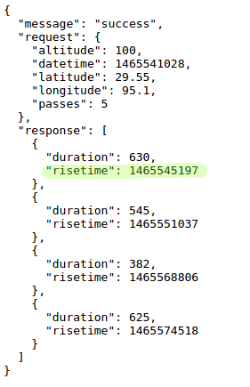

## ¿Cuándo estará la ISS por encima de tu posición?

También hay un servicio web que puedes utilizar para saber cuándo la ISS estará en una ubicación en particular.

Averigüemos cuándo será la próxima pasada de la ISS sobre el Centro Espacial en Houston, EE. UU., que se encuentra en la latitud `29.5502` y longitud `95.097`.

+ Primero trazamos un punto en el mapa en esas coordenadas:

Ahora vamos a obtener la fecha y hora en que la ISS pasará por encima.

+ Como antes, puede llamar al servicio web ingresando su URL en la barra de direcciones de un navegador web: <a href="http://api.open-notify.org/iss-pass.json" target="_blank">api.open-notify.org/iss-pass.json</a>

Debe ver un error:

Este servicio web toma latitud y longitud como entradas, por lo que debe incluirlos en la URL. Las entradas se agregan después de un `?` y se separan con `&`.

+ Añada las entradas `lat` y `lon` a la url como se muestra: <a href="http://api.open-notify.org/iss-pass.json?lat=29.55&lon=95.1" target="_blank">api.open-notify.org/iss-pass.json?lat=29.55&lon=95.1</a>

La respuesta incluye varios tiempos de paso, y nosotros solo vamos a ocuparnos del primero. El tiempo se da como una marca de tiempo de Unix (podrá convertirlo a un tiempo legible en su script de Python).

[[[generic-unix-timestamp]]]

+ Ahora llamemos al servicio web de Python. Agregue el siguiente código al final de su script:

+ Ahora obtendremos el primer paso de tiempo del resultado. Agregue el siguiente código:

Necesitamos el módulo Python `time` para que podamos imprimirlo en un formato legible y convertirlo a tiempo local. Luego obtendremos el script para escribir el tiempo de paso por el punto para Houston.

+ Añada una línea `import time` en la parte superior de su script:

+ La función `time.ctime()` convertirá la marca de tiempo en un formato legible que puede escribir en su mapa:

(Puede eliminar la línea `print` o convertirla en un comentario añadiendo `#` al principio para que su script la ignore.)

+ Si lo desea, puede cambiar el color y el formato del texto. 

[[[generic-python-turtle-write]]]