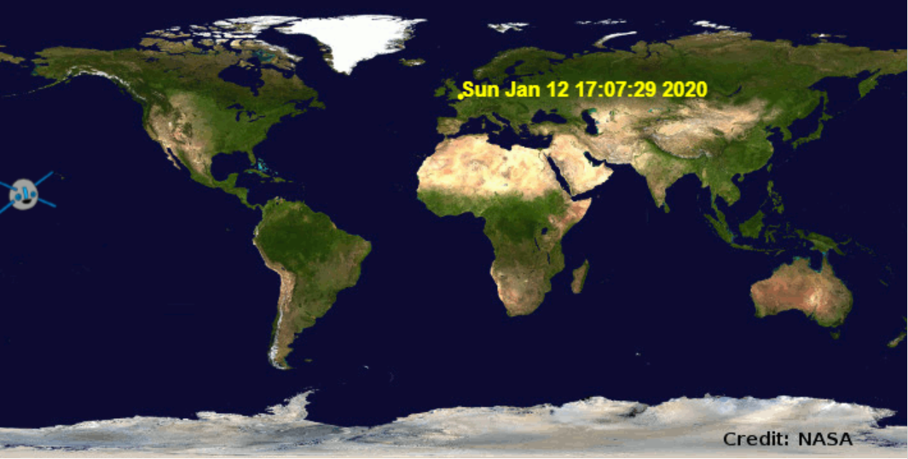

## Desafío: encontrar más veces cuando pasará por encima

\--- challenge \---

Para buscar la latitud y longitud de una ubicación que te interese, puedes usar un sitio web como <a href="http://www.latlong.net/" target="_blank">www.latlong.net/</a>.

+ ¿Puedes buscar y trazar las horas de paso para más ubicaciones? 



\--- hints \--- \--- hint \---

Al final de tu programa, configura las variables `lat` y `lon` con los nuevos valores y luego usa la variable `lugar` de la tortuga para dibujar un punto en la nueva ubicación. (Elije un color diferente si lo deseas). Luego llama al servicio web`iss-pass` con las coordenadas (puedes copiar y pegar el código para hacer esto). Finalmente, obtén el valor de `risetime` de la respuesta, y escríbelo con la variable `lugar` de la tortuga.

\--- /hint \--- \--- hint \---

Agrega este código al final de tu programa y completa las partes faltantes. Ten en cuenta que puedes copiar y pegar el código que escribiste para obtener el tiempo de paso para el Centro Espacial en Houston y luego realizar los cambios que necesites.

```python
# Tu ubicación elegida
lat = XX.XX
lon = XX.XX

# Dibuja un punto con el `lugar` de la tortuga (no es necesario crear una nueva tortuga), elije un color diferente

# Obten el resultado de` iss- pass.json` para tu nueva latitud y longitud

# Obten el `risetime` del resultado y usa ` lugar` de la tortuga para escribirlo en el mapa
```

\--- /hint \--- \--- hint \---

Este es un ejemplo de la ubicación del Cosmódromo de Baikonur, un puerto espacial en el sur de Kazajstán. El código va al final de tu programa, después de trazar el tiempo de transferencia del Centro Espacial de Houston.

```python
# Cosmódromo de Baikonur
lat = 45.86
lon = 63.31

lugar.penup()
lugar.color('orange')
lugar.goto(lon, lat)
lugar.dot(5)
lugar.hideturtle()

url = 'http://api.open-notify.org/iss-pass.json?lat=' + str (lat) + '&lon =' + str (lon)
respuesta = urllib.request.urlopen(url)
resultado = json.loads(response.read())

#print(resultado)
encima = resultado['respuesta'][1]['risetime']
lugar.write(time.ctime(over))
```

¡Intenta añadir más ubicaciones!

\--- / hint \--- \--- / hints \--- \--- / challenge \---