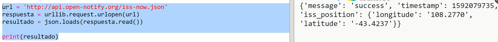
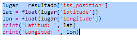

## ¿Dónde está la EEI?

La Estación Espacial Internacional está en órbita alrededor de la Tierra. Completa una órbita alrededor de la Tierra aproximadamente cada hora y media, y viaja a una velocidad promedio de 7.66 km por segundo. ¡Es rápida!

Usemos otro servicio web para averiguar dónde está la Estación Espacial Internacional.

+ Primero abre la URL del servicio web en una nueva pestaña en tu navegador web: <a href="http://api.open-notify.org/iss-now.json" target="_blank">http://api.open-notify.org/iss-now.json</a>

Deberás ver algo como esto:

    {
    "iss_position": {
      "latitude": 8.54938193505081, 
      "longitude": 73.16560793639105
    }, 
    "message": "success", 
    "timestamp": 1461931913
    }
    

El resultado contiene las coordenadas del lugar en la Tierra sobre el cual se encuentra actualmente la EEI.

[[[generic-theory-lat-long]]]

+ Ahora necesitas llamar al mismo servicio web desde Python. Agrega el siguiente código al final de tu script para obtener la ubicación actual de la EEI:

+ Vamos a crear variables para almacenar la latitud y longitud, y luego imprimirlas:

