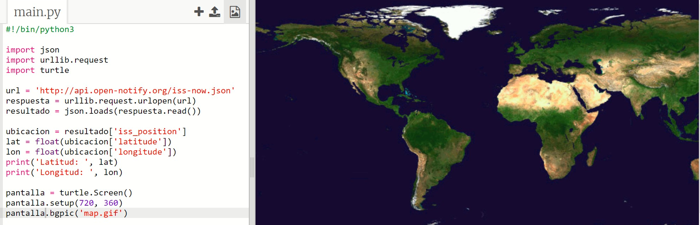

## Mostrando a la EEI en un mapa

Sería útil mostrar la posición en un mapa. ¡Puedes hacer esto usando gráficos de Python Turtle!

+ Primero necesitaremos importar la `tortuga` de la biblioteca de Python:

+ A continuación, carga un mapa del mundo como imagen de fondo. ¡Ya hay uno incluido en tu trinket llamado 'map.gif'! La NASA ha proporcionado este hermoso mapa y ha dado permiso para su reutilización. 

El mapa está centrado en latitud y longitud `(0,0)`, que es justo lo que necesitas.

+ Debes configurar el tamaño de la pantalla para que coincida con el tamaño de la imagen, que es de 720 por 360 píxeles. Añadir `screen.setup(720, 360)`:

+ Lo que quieres es ser capaz de enviar la tortuga a una determinada latitud y longitud. Para hacer esto fácil, puedes configurar la pantalla para que coincida con las coordenadas que estás utilizando:

Ahora las coordenadas coincidirán con las coordenadas de latitud y longitud que obtiene del servicio web.

+ Vamos a crear un icono de tortuga para la EEI. Tu trinket incluye 'iss.gif' y 'iss2.gif' - pruébalos y mira cuál prefieres. 

[[[generic-python-turtle-image]]]

--- hints ---
 --- hint ---

Tu código debe parecerse a esto:

--- /hint ---

--- /hints ---

+ La EEI aparece en el centro del mapa, ahora vamos a moverla a la ubicación correcta:

**Nota**: la latitud normalmente se da en primer lugar, pero necesitamos dar la longitud primero al trazar las coordenadas `(x, y)`.

+ Prueba el programa ejecutándolo. La EEI debería moverse a su ubicación actual sobre la Tierra. 

+ Espera unos segundos y vuelve a ejecutar tu programa para ver a dónde se ha movido la EEI.