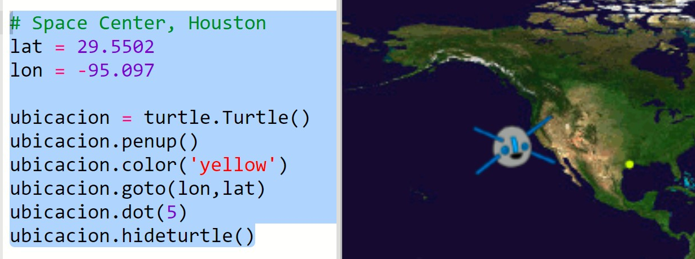
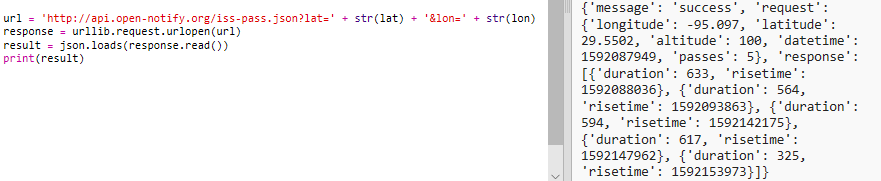
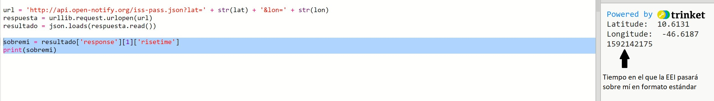
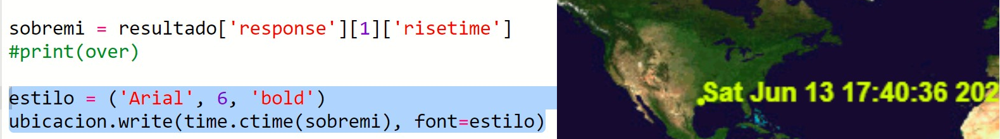

## ¿Cuándo estará la EEI por encima de tu posición?

También hay un servicio web que puedes utilizar para saber cuándo la EEI estará en una ubicación en particular.

Descubramos cuándo será la próxima vez que la EEI se aproximará sobre el Centro Espacial en Houston, EE.UU., qu está en latitud `29.5502` y longitud `95.097`.

+ Primero trazamos un punto en el mapa en esas coordenadas:

Ahora vamos a obtener la fecha y hora en que la EEI pasará por encima.

+ Como antes, puedes llamar al servicio web ingresando su URL en la barra de direcciones de un navegador web: <a href="http://api.open-notify.org/iss-pass.json" target="_blank">api.open-notify.org/iss-pass.json</a>

Debes ver un error:

Este servicio web toma latitud y longitud como entradas, por lo que debes incluirlos en la URL. Las entradas se agregan después de un `?` y se separan con `&`.

+ Añade las entradas `lat` y `lon` a la url como se muestra: <a href="http://api.open-notify.org/iss-pass.json?lat=29.55&lon=95.1" target="_blank">api.open-notify.org/iss-pass.json?lat=29.55&lon=95.1</a>

La respuesta incluye varios tiempos de paso, y nosotros solo vamos a ocuparnos del primero. El tiempo se da como una marca de tiempo de Unix (podrás convertirlo a un tiempo legible en tu código de Python).

[[[generic-unix-timestamp]]]

+ Ahora llamemos al servicio web desde Python. Agrega el siguiente código al final de tu script:

+ Ahora vamos a obtener el primer tiempo de paso del resultado. Agrega el siguiente código:

Necesitaremos el módulo Python `time` para que podamos imprimirlo en un formato legible y convertirlo a tiempo local. Luego obtendremos el código para escribir el tiempo de paso sobre Houston.

+ Añada una línea `import time` en la parte superior de tu script:

+ La función `time.ctime()` convertirá la marca de tiempo en un formato legible para que lo puedas escribir en tu mapa:

(Puedes eliminar la línea `print`, o convertirla en un comentario añadiendo `#` al principio para que tu script la ignore.)

+ Si lo deseas, puedes cambiar el color y el formato del texto. 

[[[generic-python-turtle-write]]]