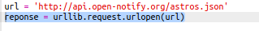
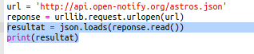
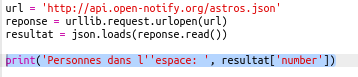
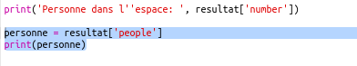
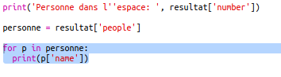

## Qui est dans l'Espace ?

Tu vas utiliser un web-service qui fournit des informations en temps réel à propos de l'espace. D'abord on va découvrir qui est actuellement dans l'espace.

+ Un web-service a une adresse (url) comme une page web. Au lieu de renvoyer du HTML dans le cas d'une page web, il retourne des données.  

    Ouvrir <a href="http://api.open-notify.org/astros.json" target="_blank">http://api.open-notify.org/astros.json</a> dans ton navigateur.

    Ça devrait ressembler à :

    ```
    {
      "message": "success",
      "number": 3,
      "people": [
        {
          "craft": "ISS",
          "name": "Yuri Malenchenko"
        },
        {
          "craft": "ISS",
          "name": "Timothy Kopra"
        },
        {
          "craft": "ISS",
          "name": "Timothy Peake"
        }
      ]
    }
    ```

    Les données sont en direct donc tu verras d'autres valeurs. Le format s'appelle JSON (prononcé Géson).

+ Appelons le web-service depuis Python pour pouvoir utiliser les données.

    Ouvres ce trinket: <a href="http://jumpto.cc/iss-go" target="_blank">jumpto.cc/iss-go</a>.

+ Les modules `urllib.request` et `json` ont déjà été importés pour toi.

    Ajoutes le code suivant à `main.py` pour mettre l'adresse web que tu viens d'utiliser dans une variable :

    

+ Maintenant appelons le web-service :

    


+ Ensuite tu as besoin de charger la réponse JSON dans une structure de données Python :

    


    Ça devrait ressembler à :

    ```
    {'message': 'success', 'number': 3, 'people': [{'craft': 'ISS', 'name': 'Yuri Malenchenko'}, {'craft': 'ISS', 'name': 'Timothy Kopra'}, {'craft': 'ISS', 'name': 'Timothy Peake'}]}
    ```

    Ceci est un dictionnaire Python avec 3 clés : message, number et people.

    La valeur ‘success’ du message t'indique le succès de la requête. Bravo.

    A noter que les résulats seront différents selon qui est présent dans l'espace !

+ Maintenant affichons les informations de façon plus lisible.

    D'abord, cherchons le nombre de personnes présentes dans l'espace et affichons le :

    

    `result['number']` affichera la valeur associée à la clé ‘number’ le dictionnaire. Dans l'exemple c'est `3`.

+ La valeur associée à la clé ‘people’ est une liste de dictionnaires ! Mettons cette valeur dans une variable pour pouvoir l'utiliser :

    


    Ça devrait ressembler à :

    ```
    [{'craft': 'ISS', 'name': 'Yuri Malenchenko'}, {'craft': 'ISS', 'name': 'Timothy Kopra'}, {'craft': 'ISS', 'name': 'Timothy Peake'}]
    ```

+ Maintenant tu as besoin d'afficher une ligne pour chaque astonaut.

    Tu peux utiliser une boucle 'for' pour le faire en Python. A chaque passage dans la boucle, `p` correspondra à un dictionnaire d'un astronaute différent.

    

+ Tu peux ensuite chercher les valeurs pour ‘name’ et ‘craft’

    

    Ça devrait ressembler à :

    ```
    People in Space:  3
    Yuri Malenchenko
    Timothy Kopra
    Timothy Peake
    ```

    Tu utilises les données en direct donc le résultat dépendra du nombre de personnes actuellement dans l'espace.
