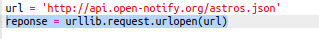
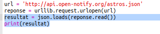
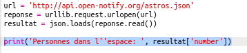

## Qui est dans l'espace ?

Tu vas utiliser un service web qui fournit des informations en direct sur l'espace. D’abord, découvrons qui est actuellement dans l’espace.

Un service web a une adresse (URL) comme un site web. Au lieu de renvoyer du HTML pour une page Web, il renvoie des données.

+ Ouvre <a href="http://api.open-notify.org/astros.json" target="_blank">le service web</a> dans un navigateur web.

Tu dois voir quelque chose comme ça :

    {
      "message": "success",
      "number": 3,
      "people": [
        {
          "craft": "ISS",
          "name": "Yuri Malenchenko"
        },
        {
          "craft": "ISS",
          "name": "Timothy Kopra"
        },
        {
          "craft": "ISS",
          "name": "Timothy Peake"
        }
      ]
    }
    

Les données sont en direct, donc tu vois probablement un résultat légèrement différent. Le format de données est appelé `JSON` (prononcé comme 'Jason').

[[[generic-json]]]

Tu dois appeler le service web à partir d'un script Python, pour pouvoir utiliser les résultats.

+ Ouvre cette trinket : <http://rpf.io/iss-on>{:target="_blank"}.

Les modules `urllib.request` et `json` ont déjà été importés pour toi en haut du script `main.py`.

+ Ajoute le code suivant à `main.py` pour stocker l'URL du service web auquel tu as accédé en tant que variable :

+ Maintenant, appelle le service web :

+ Ensuite, tu dois charger la réponse JSON dans une structure de données Python :

Tu dois voir quelque chose comme ça :

    {'message': 'success', 'number': 3, 'people' : [{'craft': 'ISS', 'name': 'Yuri Malenchenko'}, {'craft': 'ISS', 'name': 'Timothy Kopra'}, {'craft': 'ISS', 'name': 'Timothy Peake'}]}
    

Il s'agit d'un dictionnaire Python avec trois clés : `message`, `number`, et `people`.

[[[generic-python-key-value-pairs]]]

Ce `message` a la valeur `success` te dit que tu as accédé au service web. Note que tu vois différents résultats pour `number` et `people` selon qui est actuellement dans l'espace.

Maintenant, imprimons l'information de manière plus lisible.

+ Tout d'abord, recherchons le nombre de personnes dans l'espace et imprimons-le:

`resultat['number']` affichera la valeur associée à la clé `number` dans le dictionnaire `resultat`. Dans l’exemple, il s’agit de `3`.

+ La valeur associée à la clé `people` est une liste de dictionnaires ! Mettons cette valeur dans une variable pour que tu puisses l'utiliser:

Tu devrais voir quelque chose comme ça :

    [{'craft': 'ISS', 'name': 'Yuri Malenchenko'}, {'craft': 'ISS', 'name': 'Timothy Kopra'}, {'craft': 'ISS', 'name': 'Timothy Peake'}]
    

+ Maintenant tu dois imprimer une ligne pour chaque astronaute. Tu peux utiliser une boucle Python `for` pour ce faire.

[[[generic-python-for-loop-list]]]

+ À chaque fois à travers la boucle, `p` sera défini sur un dictionnaire pour un astronaute différent.

+ Tu peux ensuite rechercher les valeurs pour `name` et `craft`. Montrons les noms des personnes dans l'espace :

Tu devrais voir quelque chose comme ça :

    Personnes dans l'espace : 3
    Yuri Malenchenko
    Timothy Kopra
    Timothy Peake
    

**Note:** Tu utilises des données en direct, donc tes résultats dépendront du nombre de personnes actuellement dans l'espace.