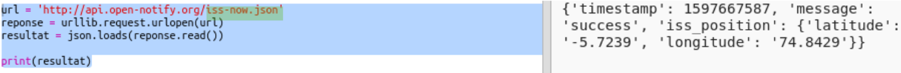
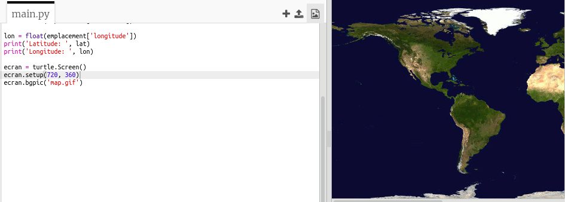
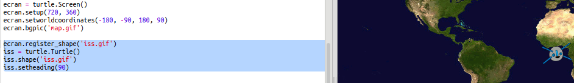

## Où est l'ISS ?

La Station Spatiale Internationale orbite autour de la Terre. Elle fait le tour de la Terre environ toutes les 90 minutes. L'ISS se déplace à une vitesse moyenne de 7.66 km par seconde. C'est du rapide !

Utilisons un autre web-service pour trouver où se situe la Station Spatiale Internationale.

+ D'abord ouvres l'url pour le web-service dans un autre onglet dans ton navigateur : <a href="http://api.open-notify.org/iss-now.json" target="_blank">http://api.open-notify.org/iss-now.json</a>

    Ça devrait ressembler à :

    ```
    {
    "iss_position": {
      "latitude": 8.54938193505081,
      "longitude": 73.16560793639105
    },
    "message": "success",
    "timestamp": 1461931913
    }
    ```

    Le résulat contient les coordonnées du point sur la Terre au-dessus duquel l'ISS se trouve actuellement.

    La Longitude est la position Est-Ouest et elle passe entre -180 et 180. 0 est le Premier Méridien qui traverse Greenwich à Londres, au Royaume-Uni.

    La Latitude est la position Nord-Sud et elle passe entre 90 et -90. 0 est l'Equateur terrestre.

+ Maintenant tu as besoin d'appeler le même web-service à travers Python. Ajoute le code suivant à la fin de ton script pour récupérer la position actuelle de l'ISS :

    


+ Créons des variables pour stocker la latitude et la longitude, puis les afficher :

    

+ Ça sera plus utile de l'afficher sur une carte.

    D'abord on a besoin d'importer la bibliothèque graphique 'turtle'.

    

+ Chargeons une carte du monde comme image de fond d'écran, il y a déjà un inclus dans ton trinket.

    

    La NASA a fourni cette jolie carte et a donné permission pour sa réutilisation.

    La carte est centrée sur 0, 0 comme il faut.

+ Tu as besoin de fixer la taille d'écran pour correspondre à la taille d'image qui est 720 x 360.

    Add `screen.setup(720, 360)`:

    

+ Tu veux pouvoir envoyer la 'turtle' à une latitude et longtitude donnée. Afin de faciliter cette tache, nous pouvons paramétrer l'écran pour correspondre aux coordonnées que nous utilisons

    

    Maintenant les coordonnées correspondront à la latitude et longitude que nous avons reçu en retour du web-service.

+ Créons une 'turtle' pour l'ISS.

    

    Ton projet inclut les fichiers 'iss.png' et 'iss2.png', essayes les deux images pour voir celle que vous préférez.

+ L'ISS commence au centre de la carte, maintenant mettons-la au bon endroit sur la carte :

    

    A noter que la latitude, d'habitude, est donnée en premier, mais nous avons besoin de la longitude d'abord quand on trace les coordonnées (x,y).

+ Teste ton programme en l'exécutant. L'ISS devrait bouger à sa position au-dessus de la Terre.

    Attends quelques secondes et exécuter ton programme encore pour voir jusqu'où l'ISS a bougé.

    
