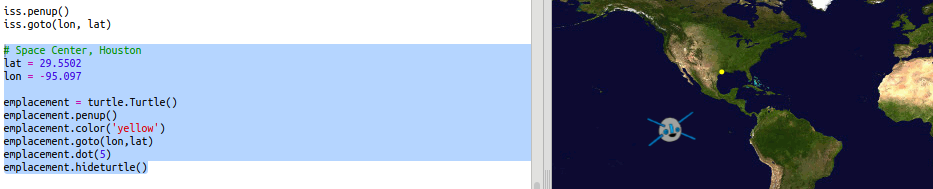
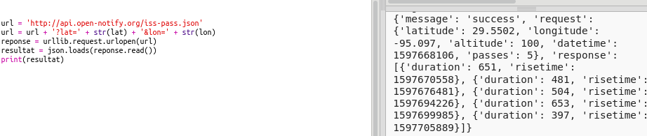
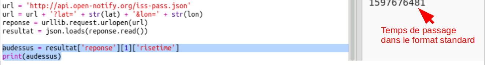
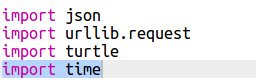
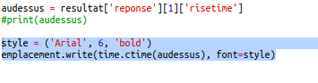

## Quand est-ce l'ISS sera au-dessus d'une position ?

Il existe aussu un web-service que tu peux appeler pour savoir quand est-ce que l'ISS sera au-dessus d'une certaine position.

Cherchons à savoir quand est-ce l'ISS sera au-dessus du Space Centre à Houston aux États Unis qui se situe à latitude 29.5502 et longitude 95.097.

+ D'abord plaçons un point sur la carte aux coordonnées données :

    

+ Maintenant cherchons la date et heure à laquelle l'ISS va passer au-dessus.

    Comme avant, nous pouvons appeler le web-service en entrant l'url dans la barre d'adresse du navigateur : <a href="http://api.open-notify.org/iss-pass.json" target="_blank">http://api.open-notify.org/iss-pass.json</a>

    Tu devrais rencontrer une erreur :

    

+ Ce web-service prend comme données d'entrée les valeurs de latitude et longitude donc nous devrions les inclure dans l'url que nous utilisons.

    Les données à entrer sont ajoutées après un `?` et séparées par un `&`.

    Ajouter les entrées `lat` et `lon` dans l'url comme indiqué : <a href="http://api.open-notify.org/iss-pass.json?lat=29.55&lon=95.1" target="_blank">http://api.open-notify.org/iss-pass.json?lat=29.55&lon=95.1</a>

    

    La réponse renvoie l'heure de plusieurs passages, nous allons regarder que le premier. L'heure est donnée dans un format standard pour le temps, tu vas pouvoir le convertir dans un format lisible avec Python.

+  Maintenant appelons le web-service à partir de Python. Ajoute le code suivant à la fin de ton script :

    

+ Maintenant récupérons l'heure du premier passage du résultat.

    Ajoute le code suivant :

    

+ L'heure est donnée comme un tampon date-heure donc on aura besoin d'utiliser le module time de Python pour pouvoir l'afficher dans un format lisible et la convertir pour l'heure locale. Faisons écrire l'heure du passage à coté du point en utilisant la 'turtle'.

+ Ajoute une ligne `import time` en haut de ton script :

    

+ La fonction `time.ctime()` convertira l'heure dans une forme lisible que tu peux écrire avec la 'turtle' :

    

    (Tu peux enlever ou commenter la ligne `print`.)
