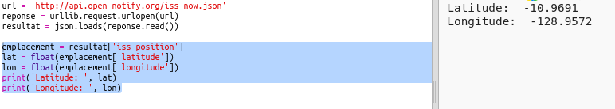

## Où est l'ISS?

La Station spatiale internationale est en orbite autour de la Terre. Elle complète une orbite de la terre à peu près toutes les heures et demies, et voyage à une vitesse moyenne de 7,66 km par seconde. C'est rapide !

Nous allons utiliser un autre service web pour savoir où se trouve la Station spatiale internationale.

+ Commence par ouvrir l'URL du service web dans un nouvel onglet dans ton navigateur web : <a href="http://api.open-notify.org/iss-now.json" target="_blank">http://api.open-notify.org/iss-now.json</a>

Tu devrais voir quelque chose comme ça :

    {
    "iss_position": {
      "latitude": 8.54938193505081, 
      "longitude": 73.16560793639105
    }, 
    "message": "success", 
    "timestamp": 1461931913
    }
    

Le résultat contient les coordonnées de l'endroit sur Terre où se trouve actuellement l'ISS.

[[[generic-theory-lat-long]]]

+ Maintenant appelons le web-service à partir de Python. Ajoute le code suivant à la fin de ton script :

+ Créons des variables pour stocker la latitude et la longitude, puis les imprimer :

