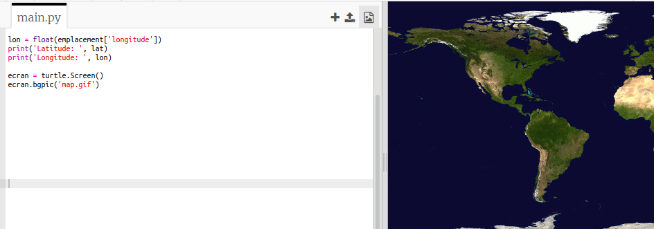
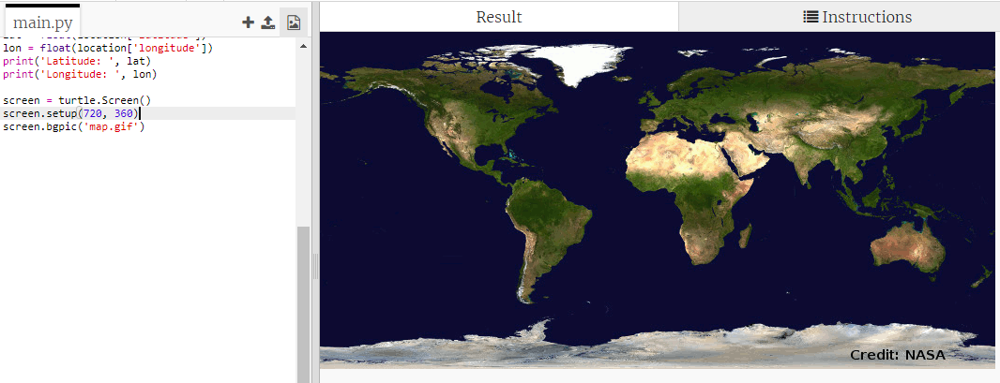
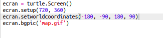
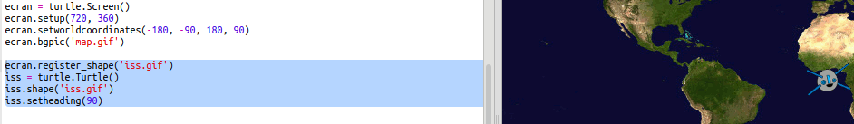
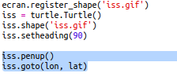

## Tracer l'ISS sur une carte

Il serait utile de montrer la position sur une carte. Tu peux le faire en utilisant les graphiques de Python Turtle !

+ D'abord, nous allons devoir importer la bibliothèque Python `turtle` :

+ Ensuite, charger une carte du monde comme image de fond. Il y en a une déjà inclus dans votre trinket appelée 'map.gif'! La NASA a fourni cette belle carte et a donné l'autorisation pour la réutilisation. 

La carte est centrée à `(0,0)` de latitude et de longitude, ce qui est exactement ce dont tu as besoin.

+ Tu dois définir la taille de l'écran pour correspondre à la taille de l'image, qui est de 720 par 360 pixels. Ajouter `ecran.setup(720, 360)`:

+ Tu veux pouvoir envoyer la tortue à une latitude et une longitude particulières. Pour rendre cela facile, tu peux définir l'écran pour qu'il corresponde aux coordonnées que tu utilises:

Maintenant, les coordonnées correspondent aux coordonnées de latitude et de longitude que vous obtiendrez du service web.

+ Créons une icône de tortue pour l’ISS. Ton trinket inclut 'iss.gif' et 'iss2.gif' — essaie-les toutes les deux et vois celle que tu préféres. 

[[[generic-python-turtle-image]]]

--- hints ---
 --- hint ---

Ton code devrait ressembler à ceci:

--- /hint ---

--- /hints ---

+ L'ISS commence au centre de la carte, nous allons maintenant le déplacer à l'emplacement correct :

**Note** : la latitude est normalement donnée en premier, mais nous devons d'abord donner de la longitude lors du tracé des coordonnées `(x,y)`.

+ Teste ton programme en l'exécutant. L'ISS devrait se déplacer à son emplacement actuel au-dessus de la Terre. 

+ Attends quelques secondes et lance à nouveau ton programme pour voir où l'ISS s'est déplacé.