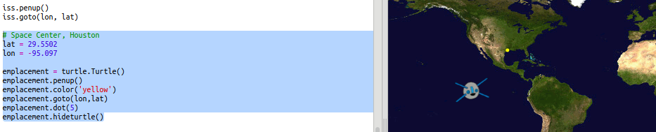
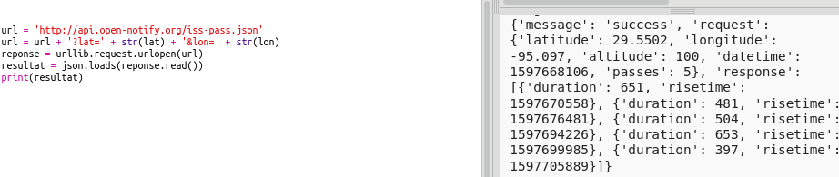

## Quand l'ISS sera-t-il au-dessus?

Il y a aussi un service web que tu peux utiliser pour savoir quand l’ISS se trouvera ensuite sur un emplacement particulier.

Découvrons quand l’ISS sera sur le Centre Spatial de Houston, aux Etats-Unis, qui est à la latitude `29.5502` et à la longitude `95.097`.

+ Commençons par tracer un point sur la carte à ces coordonnées :

Maintenant nous allons obtenir la date et l'heure du prochain passage de l'ISS au-dessus de là.

+ Comme avant, tu peux appeler le service web en entrant son URL dans la barre d'adresse d'un navigateur web : <a href="http://api.open-notify.org/iss-pass.json" target="_blank">api.open-notify.org/iss-pass.json</a>

Tu devrais voir une erreur :

Ce service web prend la latitude et la longitude en tant qu'entrées, donc tu dois les inclure dans l'URL. Les entrées sont ajoutées après un `?` et séparées par `&`.

+ Ajouter les entrées `lat` et `lon` à l'url comme indiqué : <a href="http://api.open-notify.org/iss-pass.json?lat=29.55&lon=95.1" target="_blank">api.open-notify.org/iss-pass.json?lat=29.55&lon=95.1</a>

La réponse comprend plusieurs temps de passage, et nous allons juste regarder la première. L'heure est donnée sous forme d'horodatage Unix (vous pourrez la convertir en une heure lisible dans votre script Python).

[[[generic-unix-timestamp]]]

+ Appelons maintenant le service Web depuis Python. Ajoute le code suivant à la fin de ton script:

+ Voyons maintenant le premier temps de passage à partir du résultat. Ajoute le code suivant:

Nous aurons besoin du module Python `time` pour pouvoir l'imprimer sous une forme lisible et le convertir en heure locale. Ensuite, nous allons obtenir le script pour écrire le temps de passage par le point pour Houston.

+ Ajouter une ligne `import time` en haut de votre script:

+ La fonction `time.ctime()` convertira l'horodatage en une forme lisible que tu peux écrire sur ta carte :

(Tu peux supprimer la ligne `print` ou la transformer en un commentaire en ajoutant `#` au début pour que ton script l'ignore.)

+ Si tu le souhaites, tu peux changer la couleur et le format du texte. 

[[[generic-python-turtle-write]]]