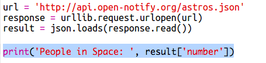
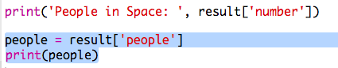

## अंतरिक्ष में कौन है?

आप एक वेब सेवा का उपयोग करने जा रहे हैं जो अंतरिक्ष के बारे में लाइव जानकारी प्रदान देती है। सबसे पहले, आइए जानें कि वर्तमान में कौन अंतरिक्ष में है।

वेबसाइट की तरह ही, हर वेब सेवा का पता होता है जिसे हम यूआरएल (URL) कहते हैं। फरक यह है की वेबपेज की तरह एचटीएमएल (HTML) वापस भेजने के बजाय, यह डेटा लौटाता है।

+ <a href="http://api.open-notify.org/astros.json" target="_blank">वेब सेवा</a> को वेब ब्राउज़र में खोलें ।

आपका वेबपेज कुछ इस तरह दिखाई देना चाहिए:

    {
      "message": "success",
      "number": 3,
      "people": [
        {
          "craft": "ISS",
          "name": "Yuri Malenchenko"
        },
        {
          "craft": "ISS",
          "name": "Timothy Kopra"
        },
        {
          "craft": "ISS",
          "name": "Timothy Peake"
        }
      ]
    }
    

डेटा लाइव है, इसलिए आप शायद थोड़ा अलग परिणाम देखेंगे। डेटा प्रारूप को ` JSON ` कहा जाता है ('जेसन' की तरह उच्चारण)।

[[[generic-json]]]

आपको पायथन स्क्रिप्ट से वेब सेवा को कॉल करने की आवश्यकता है, ताकि आप परिणामों का उपयोग कर सकें।

+ इस ट्रिंकेट को खोलें: [ http://rpf.io/iss-on ](http://rpf.io/iss-on)

` urllib.request ` और ` json ` मॉड्यूल पहले से ही आपके लिए ` main.py` स्क्रिप्ट में इम्पोर्ट किए जा चुके हैं ।

+ निम्न कोड को ` main.py` में जोड़ें ताकि जिस वेब सेवा का आपने अभी प्रयोग किया था उसके यूआरएल को वेरिएबल में स्टोर कर सकें

+ अब वेब सेवा को कॉल करें:

+ आगे आपको पायथन डेटा स्ट्रक्चर में JSON प्रतिक्रिया लोड करने की आवश्यकता है:

आपका वेबपेज कुछ इस तरह दिखाई देना चाहिए:

    {'message': 'success', 'number': 3, 'people': [{'craft': 'ISS', 'name': 'Yuri Malenchenko'}, {'craft': 'ISS', 'name': 'Timothy Kopra'}, {'craft': 'ISS', 'name': 'Timothy Peake'}]}
    

यह तीन keys वाला पायथन शब्दकोश है: `message`, `number`, और `people` ।

[[[generic-python-key-value-pairs]]]

वह `message` जिसकी वैल्यू है `success` आपको बताता है कि आपने वेब सेवा को सफलतापूर्वक एक्सेस किया है। ध्यान दें कि आपको `number` और `people` के लिए अलग परिणाम दिखाई देंगे और वह अंतरिक्ष में वर्तमान में कौन है, इस पर निर्भर करता है।

अब सूचना को इस तरह प्रिंट करते हैं ताकि उसे पढ़ने और समझने में आसानी हो।

+ पहले, चलो अंतरिक्ष में लोगों की संख्या देखते हैं और इसे प्रिंट करते हैं:

`result['number']` जो है वह `result` शब्दकोश में `number` key के साथ जुड़े मूल्य को प्रिंट करेगा। इस उदाहरण में, यह `3` है।

+ `people` key के साथ जुड़ी हुई वैल्यू शब्दकोशों की एक सूची के समान है! आइए उस वैल्यू को एक वेरिएबल में रखें ताकि आप इसका उपयोग कर सकें:

आपको कुछ इस तरह दिखाई देना चाहिए:

    [{'craft': 'ISS', 'name': 'Yuri Malenchenko'}, {'craft': 'ISS', 'name': 'Timothy Kopra'}, {'craft': 'ISS', 'name': 'Timothy Peake'}]
    

+ अब आपको प्रत्येक अंतरिक्ष यात्री के लिए एक लाइन प्रिंट करनी है। ऐसा करने के लिए आप पाइथन `for` लूप का उपयोग कर सकते हैं।

[[[generic-python-for-loop-list]]]

+ हर बार लूप के माध्यम से, `p` एक अलग अंतरिक्ष यात्री के लिए एक शब्दकोश में सेट किया जाएगा।

+ फिर आप `name` और `craft` की वैल्यू देख सकते हैं। आइए अंतरिक्ष में गए लोगों के नाम दिखाएं:

आपको कुछ इस तरह दिखाई देना चाहिए:

    People in Space:  3
    Yuri Malenchenko
    Timothy Kopra
    Timothy Peake
    

**Note: ** आप लाइव डेटा का उपयोग कर रहे हैं, इसलिए आपके परिणाम वर्तमान में अंतरिक्ष में मौजूद लोगों की संख्या पर निर्भर करेंगे।