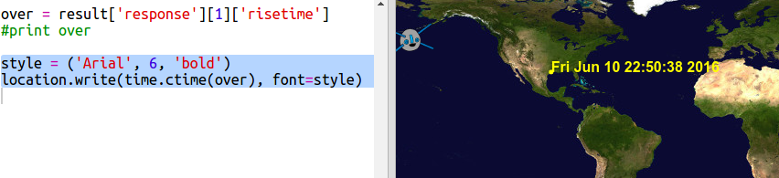

## आईएसएस (ISS) उनके ऊपर से कब गुज़रेगा?

एक वेब सेवा ऐसी भी है जिसका उपयोग आप यह पता लगाने के लिए कर सकते हैं कि आईएसएस (ISS) अगली बार किसी विशेष स्थान पर कब होगा।

आइए जानें कि आईएसएस(ISS) अगली बार ह्यूस्टन, यूएसए में स्पेस सेंटर के ऊपर कब होगा, जो लेटीट्‍यूड `29.5502` और लोंगीट्‍यूड`95.097` पर है।

+ सबसे पहले मैप में इन निर्देशांक पर एक डॉट प्लॉट करें:

अब आइए जानें कि आईएसएस(ISS) की आपके ऊपर से गुजरने की अगली तारीख और समय क्या है।

+ पहले की तरह, आप अपने यूआरएल (URL) को किसी वेब ब्राउज़र के एड्रेस बार में डाल कर वेब सेवा को कॉल कर सकते हैं: <a href="http://api.open-notify.org/iss-pass.json" target="_blank"> api.open-notify.org/iss-pass.json </a>

आपको एक एरर दिखना चाहिए:

यह वेब सेवा लेटीट्‍यूड और लोंगीट्‍यूड को इनपुट के रूप में लेती है, इसलिए आपको उन्हें यूआरएल (URL) में शामिल करना होगा। इनपुट `?` के बाद जोड़े जाते हैं और `&` द्वारा अलग किए जाते हैं ।

+ `lat` और `lon` इनपुट को इस प्रकार यूआरएल(URL) में जोड़े: <a href="http://api.open-notify.org/iss-pass.json?lat=29.55&lon=95.1" target="_blank"> api.open-notify.org/iss-passrlson?lat=29.55&lon = 95.1 </a>

परिणाम में ऊपर से गुजरने के कई समय शामिल हैं, और हम केवल पहले एक को देखेंगे। समय को यूनिक्स टाइम स्टैम्प के रूप में दिया गया है (आप इसे अपने पाइथन स्क्रिप्ट में पढ़ने योग्य समय में बदल पाएंगे)।

[[[generic-unix-timestamp]]]

+ अब आपको पायथन से उसी वेब सेवा को कॉल करने की आवश्यकता है। निम्नलिखित कोड को अपनी स्क्रिप्ट के आखिर में जोड़ें:

+ अब परिणाम से पहला पास-ओवर समय प्राप्त करते हैं। निम्नलिखित कोड जोड़ें:

हमें पाइथन के `टाइम` मॉड्यूल की आवश्यकता होगी ताकि हम इसे पठनीय रूप में प्रिंट कर सकते हैं और इसे स्थानीय समय में बदल सकते हैं। फिर हम ह्यूस्टन के लिए डॉट द्वारा पास-ओवर समय लिखने के लिए स्क्रिप्ट प्राप्त करेंगे।

+ अपनी स्क्रिप्ट की शुरुआत में `Import time` पंक्ति जोड़ें:

+ `time.ctime() ` फ़ंक्शन टाइम स्टैम्प को एक पठनीय रूप में बदल देगा जिसे आप अपने मैप पर लिख सकते हैं:

(आप `print` पंक्ति निकाल सकते हैं, या शुरुआत में `#` जोड़कर टिप्पणी में बदल दें तो आपकी स्क्रिप्ट इसे नजरअंदाज कर देगी।)

+ यदि आप चाहें, तो आप शब्दों का रंग और प्रारूप बदल सकते हैं। 

[[[generic-python-turtle-write]]]