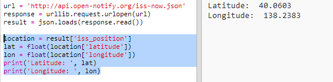
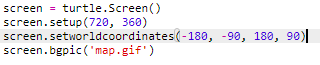
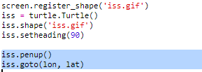

## Dov'è la ISS?

La Stazione Spaziale Internazionale è in orbita attorno alla Terra. Orbita la terra ogni ora e mezza circa. La ISS viaggia a una velocità media di 7,66 km per secondo. È veloce!

Usiamo ora un latro servizio web per scoprire dove si trova la Stazione Spaziale Internazionale.

+ Apri prima la url per il servizio web in un nuovo tab nel tu browser di internet: <a href="http://api.open-notify.org/iss-now.json" target="_blank">http://api.open-notify.org/iss-now.json</a>

    Dovresti vedere qualcosa del genere:

    ```
    {
    "iss_position": {
      "latitudine". 8,54938193505081,
      "longitudine". 73,16560793639105
    },
    "message": "success",
    "timestamp": 1461931913
    }
    ```

    Il risultato contiene le coordinate del luogo sulla Terra dove si trova attualmente la ISS.

    La longitudine è la posizione Est-Ovest e va da -180 a 180. 0 è il Meridiano Zero che attraversa Greenwich, a Londra.

    La latitudine è la posizione Nord-Sud e va da 90 a -90. 0 è l'Equatore.

+ Ora devi chiamare lo stesso servzio web da PythoN. Aggiungi il seguente codice alla fine del tuo testo per ottenere l'attuale posizione della ISS:

    


Creiamo delle variabili per salvare la latitudine e la longitdine, e poi stampiamole:

   

+ Sarebbe pià utile mostrare la posizione su una mappa.

    Innanzitutto, dobbiamo importare i cursori tartaruga dalla libreria.

   

Carichiamo una mappa del mondo come immagine di sfondo, ce n'è già una inclusa nel tuo trinket.

   

   La NASA ha fornito questa bellissima mappa e ci ha dato il permesso di riutilizzarla.

   La mappa è centrata a 0, 0 che è proprio quello di cui abbiamo bisogno.

+ Dovrai impostare la misura dello schermo per combaciare la misura dell'immagine che è 720 per 360.

    Aggiungi `setup schermo(720, 360)`:

    

+ Vui essere in grado di mandare la tartaruga a una specifica latitudine e longitudine. Per renderlo facile, possiamo impostare lo schermo per combaciare le coordinate che stiamo usando:

    

    Ora le coordinate combaceranno quelle della latitudine e longitudine che otteniamo dal servizio web.

Creiamo una tartaruga per la ISS.

   

   Il tuo progetto include 'iss.png' e 'iss2.png', provali entrambi e vedi quale preferisci.  

+ La ISS inizia nel centro della mappa, ora muoviamola verso la corretta posizione sulla mappa:

    

    Nota che la latitudine all'inizio viene data normalmente, ma dobbiamo prima dare la longitudine quando tracciamo le coordinate (x,y).

+ Prova il tuo programma facendolo partire. La ISS dovrebbe muoversi verso la sua posizione attuale sopra la Terra.

    Aspetta qualche secondo e fai partire il tuo programma di nuovo per vedere dove si è spostata la ISS.

    
