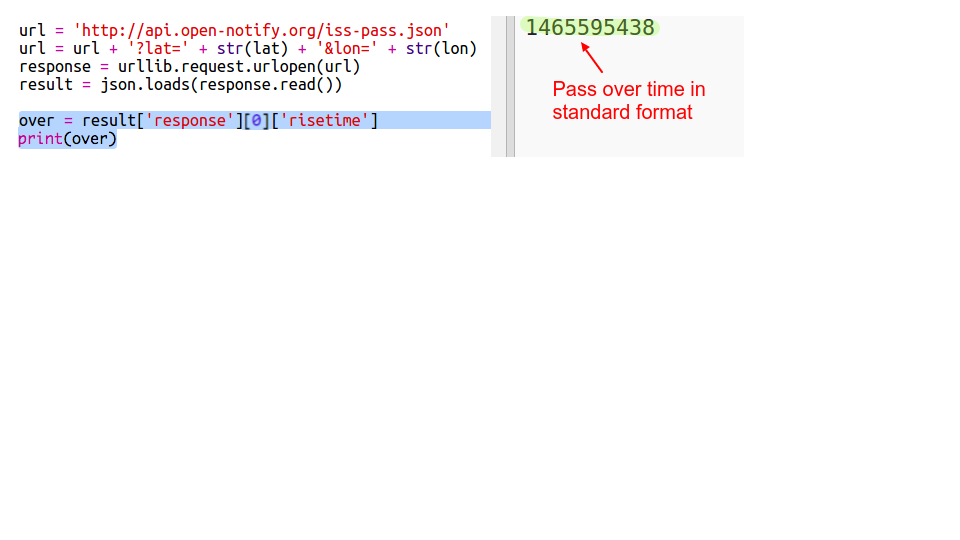
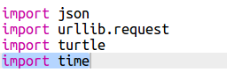

## Quando sarà la ISS in alto?

Esiste anche un servizio web che puoi chiamare per scoprire quando la ISS raggiungerà un luogo particolare.

Proviamo a scoprire quando la ISS arriverà al Centro Spaziale Di Houston, USA, che si trova a una latitudine 29.5502 e longitudine 95.097.

+ Innanzitutto, tracciamo un puntino sulla mappa a queste coordinate:

    

+ Ora otteniamo la data e l'ora in cui la ISS sarà in alto.

    Come prima, possiamo chiamare il servizio web inserendo la url nella barra dell'indirizzo di un browser di internet: <a href="http://api.open-notify.org/iss-pass.json" target="_blank">http://api.open-notify.org/iss-pass.json</a>

    Dovresti vedere un errore:

    

+ Questo servizio web prende latitudine e longitudine come input, per cui dobbiamo includerle nella url che stiamo usando.

    Gli input vengono aggiunti dopo un '?' e separati da `&`.

    Aggiungi gli input 'lat e 'lon' alla url come mostrato: <a href="http://api.open-notify.org/iss-pass.json?lat=29.55&lon=95.1" target="_blank">http://api.open-notify.org/iss-pass.json?lat=29.55&lon=95.1</a>

    

    La risposta include vari passaggi a orari diversi, noi guarderemo solo il primo. L'ora viene data in un formato standard, sarai in grado di trasformarla in una ora più leggibile in Python.

+ Ora chiamiamo il servizio web da Python: Aggiungi il seguente codice alla fine della tua scritta:

    

+ Ora otteniamo dal risultato l'ora del primo passaggio.

    Aggiungi il seguente codice:

    

+ L'ora viene data come marcatura oraria, dunque avremo bisogno del modulo orario di Python così che possiamo stamparla in una forma più leggibile e trasformarla in ora locale. Facciamo in modo che la tartaruga scriva l'orario del passaggio sul puntino.

+ Aggiungi una linea 'importa tempo' in cima alla tua scritta:

    

+ La funzione `time.ctime()` trasformerà l'ora in una forma leggibile che potrai scrivere con la tartaruga:

    

    (Puoi rimuovere o commentare la linea 'stampa').
