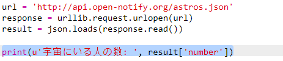
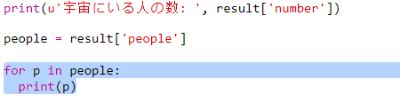
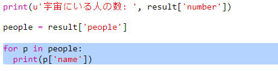

## 誰が宇宙にいるのか？

宇宙に関するライブ情報を提供するWebサービスを使用します。 まず、誰が現在宇宙にいるのかを見てみましょう。

Webサービスには、Webサイトと同じようにアドレス (URL) があります。 WebページのHTMLを返す代わりに、データを返します。

+ Webブラウザで<a href="http://api.open-notify.org/astros.json" target="_blank">Webサービス</a>を開いてみましょう。

以下のようなものが表示されます：

    {
      "message": "success",
      "number": 3,
      "people": [
        {
          "craft": "ISS",
          "name": "Yuri Malenchenko"
        },
        {
          "craft": "ISS",
          "name": "Timothy Kopra"
        },
        {
          "craft": "ISS",
          "name": "Timothy Peake"
        }
      ]
    }
    

ライブデータであるため、毎回Webサービスから返ってくるデータが同じものとは限りません。 データ形式は `JSON` ('ジェイソン'のように発音) と呼ばれます。

[[[generic-json]]]

データを使うためには、PythonスクリプトからWebサービスを呼び出す必要があります。

+ 次のTrinketのテンプレートを開きます：<http://rpf.io/iss-on>{:target="_blank"}。

`urllib.request` と `json` モジュールは、 `main.py` スクリプトの先頭にすでにインポートされています。

+ `main.py` に次のコードを追加して、アクセスしたWebサービスのURLを変数として保存します。

+ 次に、Webサービスを呼び出します。

+ 次に、JSONレスポンスをPythonのデータ構造として読み込む必要があります。

以下のようなものが表示されます：

    {'message': 'success', 'number': 3, 'people': [{'craft': 'ISS', 'name': 'Yuri Malenchenko'}, {'craft': 'ISS', 'name': 'Timothy Kopra'}, {'craft': 'ISS', 'name': 'Timothy Peake'}]}
    

これは、`message`、`number`、と `people` という3つのキーを持つPythonの辞書（ディクショナリ）です。

[[[generic-python-key-value-pairs]]]

Webサービスにアクセス成功した場合、指定したキー、`message`、に `success` の値があります。 ライブデータなので、Webサービスが返す結果が毎回同じとは限りません：`number`（宇宙にいる人の数） と `people` （宇宙にいる人）。

次に、情報を読みやすく表示しましょう。

+ まず、宇宙にいる人の数を調べて、それを表示しましょう。

`result['number']` は、`result` 辞書にあるキー `number` に関連する値のことです。 この例では、numberキーに関連する値は`3`です。

+ `people`キーに関連付けられた値は、辞書のリストです！ その値を変数に入れて使用できるようにしましょう：

次のようなものが表示されます。

    [{'craft': 'ISS', 'name': 'Yuri Malenchenko'}, {'craft': 'ISS', 'name': 'Timothy Kopra'}, {'craft': 'ISS', 'name': 'Timothy Peake'}]
    

+ 今度は、宇宙飛行士の名前を別々の行に表示しましょう。 これを行うには、Python `for` ループを使用することができます。

[[[generic-python-for-loop-list]]]

+ ループを通過するたびに、 `p` が別の宇宙飛行士に当てはまる辞書に設定されます。

+ 次に、 `name` と `craft`の値を検索できます。 宇宙にいる人たちの名前を表示しましょう：

以下のようなものが表示されます：

    宇宙にいる人の数:  3
    Yuri Malenchenko
    Timothy Kopra
    Timothy Peake
    

**注：** ライブデータを使用しているため、表示されるデータが毎回同じものとは限りません。データ現在宇宙にいる人たちをあらわしています。