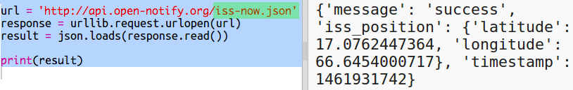
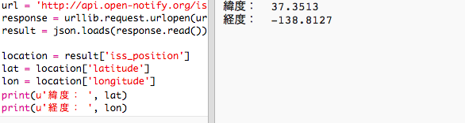

## ISSはどこですか？

国際宇宙ステーションは地球周回軌道上にあります。 地球の周回軌道をおよそ1時間半で完了し、毎秒7.66kmの平均速度で移動します。 これは速い！

国際宇宙ステーション（International Space Station）の場所を調べるために別のWebサービスを利用しましょう。

+ まず、Webブラウザの新しいタブでWebサービスのURLを開きます <a href="http://api.open-notify.org/iss-now.json" target="_blank">http://api.open-notify.org/iss-now.json</a>

次のようなものが表示されます。

    {
    "iss_position": {
      "latitude": 8.54938193505081, 
      "longitude": 73.16560793639105
    }, 
    "message": "success", 
    "timestamp": 1461931913
    }
    

ISSの位置は地球上の地点の座標としてあらわされています。

[[[generic-theory-lat-long]]]

+ Pythonから同じWebサービスを呼び出す必要があります。 スクリプトの最後に次のコードを追加して、ISSの現在の場所を取得します。

+ 緯度と経度を格納する変数を作り、表示しましょう。

