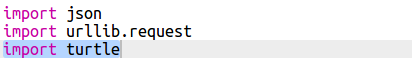
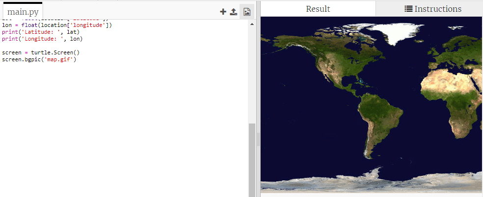
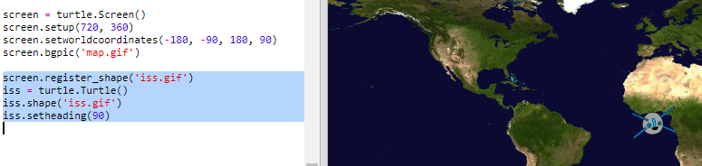
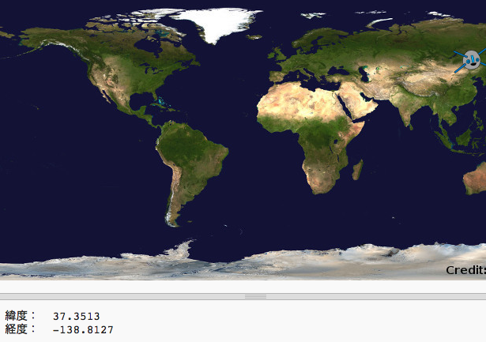

## マップにISSの位置をプロットする

位置を地図上に表示すると便利です。 Python Turtleのグラフィックを使ってこれを行うことができます！

+ 最初に、`turtle`Pythonライブラリをインポートする必要があります：

+ 次に、世界地図を背景画像として読み込みます。 There’s one already included in your trinket called 'map.gif'! NASAが提供してる地図で、再利用の許可をだしています。 

地図は、`（0,0）`緯度と経度に配置されています。

+ 画像のサイズ（720 x 360ピクセル）と一致するように画面サイズを設定する必要があります。 `screen.setup(720, 360)`を追加しましょう:

+ 特定の緯度と経度にカメを置きましょう。 これを簡単にするには、使用している座標に合わせて画面を設定します：

これで座標は、Webサービスから返された緯度と経度の座標と一致します。

+ ISSをあらわすカメアイコンを作成しましょう。 Your trinket includes 'iss.gif' and 'iss2.gif' — try them both and see which one you prefer. 

[[[generic-python-turtle-image]]]

\--- hints \--- \--- hint \---

コードは以下のようになります：

\--- /hint \--- \--- /hints \---

+ ISSアイコンは地図の中央におかれます。ISSアイコン、を正しい位置におきましょう：

**注**：通常は最初に緯度がきますが、 goto()関数を使って`（x、y）` 座標をプロットするときには関数に経度を一番最初のインプットとして入力する必要があります。

+ プログラムを実行してテストします。 ISSアイコンは地球上の現在の位置におかれます。 

+ 数秒待ってからもう一度プログラムを実行すると、ISSアイコンはどの位置に移動したか確認してください。