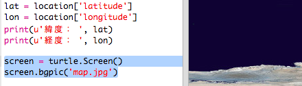

## マップにISSの位置を表示する

位置を地図上に表示すると便利です。 Python Turtleのグラフィックを使ってこれを行うことができます！

+ Load a world map as the background image. あなたのtrinketにはすでに 'map.gif'というものがあります。 NASAが提供してる地図で、再利用の許可をだしています。 

地図は、`(0,0)`緯度と経度に配置されています。

+ 画像のサイズ（720 x 360ピクセル）と一致するように画面サイズを設定する必要があります。 `screen.setup(720, 360)`を追加しましょう:

## \--- code \---

language: python filename: main.py line_numbers: true line_number_start: 26

## highlight_lines: 28, 29

# image source:

# map.jpg: http://visibleearth.nasa.gov/view.php?id=57752 Credit: NASA

screen = turtle.Screen() screen.setup(720, 360) \--- /code \---

+ 特定の緯度と経度にカメを置きましょう。 To make this easy, you can set the screen to match the coordinates you're using and add in the map image:

## \--- code \---

language: python filename: main.py line_numbers: true line_number_start: 27

## highlight_lines: 30, 31

# map.jpg: http://visibleearth.nasa.gov/view.php?id=57752 Credit: NASA

screen = turtle.Screen() screen.setup(720, 360) screen.setworldcoordinates(-180, -90, 180, 90) screen.bgpic('map.gif') \--- /code \---

これで座標は、Webサービスから返された緯度と経度の座標と一致します。

+ Create a turtle icon for the ISS. あなたのtrinketには「iss.gif」と「iss2.gif」があります—好きな画像を使ってください。 

[[[generic-python-turtle-image]]]

## \--- code \---

language: python filename: main.py line_numbers: true line_number_start: 33

## highlight_lines:

screen.register_shape('iss.gif') iss = turtle.Turtle() iss.shape('iss.gif') iss.setheading(90) \--- /code \---

+ The ISS starts off in the centre of the map, now move it to the correct location:

## \--- code \---

language: python filename: main.py line_numbers: true line_number_start: 38

## highlight_lines:

iss.penup() iss.goto(lon, lat) \--- /code \---

**注**：通常は最初に緯度がきますが、 goto()関数を使って`(x,y)` 座標をプロットするときには関数に経度を一番最初のインプットとして入力する必要があります。

+ プログラムを実行してテストします。 ISSアイコンは地球上の現在の位置におかれます。 

+ 数秒待ってからもう一度プログラムを実行すると、ISSアイコンはどの位置に移動したか確認してください。