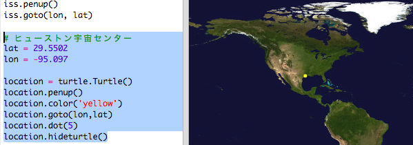
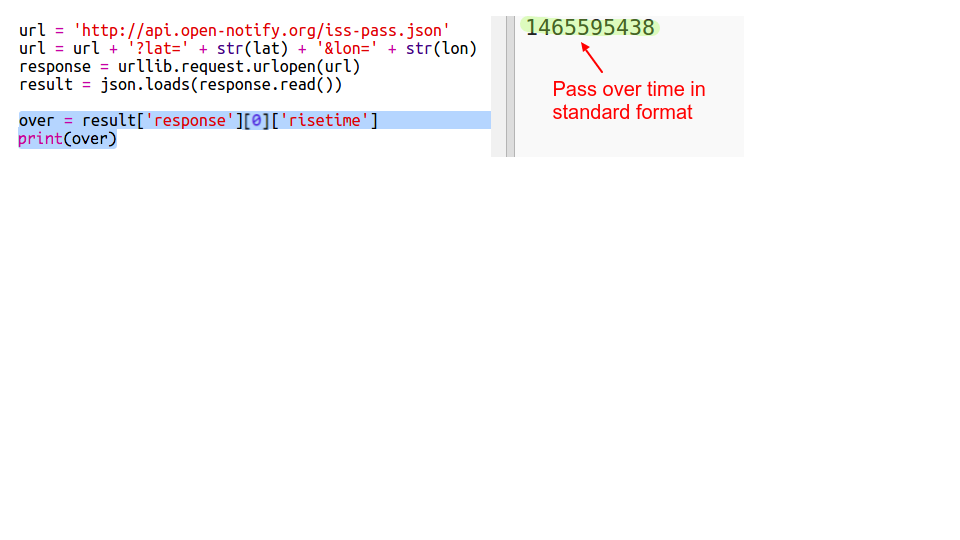
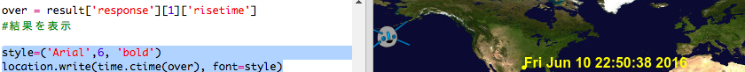

## ISSはいつ特定の場所を通過するか？

ISSがいつ特定の場所を通過するかを提供するWebサービスがあります。

ISSが、いつヒューストンの宇宙センターの位置を通過するか調べて見ましょう：緯度 `29.5502` と経度 `95.097`。

+ まず、地図上にこの座標を点として表示しましょう：

ISSが特定の場所の位置を通過する日時を取得しましょう。

+ 前と同じように、WebブラウザのアドレスバーにURLを入力すると、Webサービスを呼び出すことができます <a href="http://api.open-notify.org/iss-pass.json" target="_blank">api.open-notify.org/iss-pass.json</a>

エラーが表示されます。

このWebサービスは特定の場所の緯度と経度が必要です。URLにそれらをあらわす情報を加える必要があります。 Webサービスに提供する情報は`？`の後に加えて、`&`で分離します。

+ `lat`（緯度）と`lon`（経度）の情報をURLに追加しましょう： <a href="http://api.open-notify.org/iss-pass.json?lat=29.55&lon=95.1" target="_blank">api.open-notify.org/iss-pass.json?lat=29.55&lon=95.1</a>

Webサービスから返ってきたデータにはいくつかの日時が含まれています。最初のものだけを見ていきます。 時間はUnixのタイムスタンプとして与えられます(Pythonスクリプトで読み込み可能な時間に変換することができます)。

[[[generic-unix-timestamp]]]

+ では、PythonからWebサービスを呼び出しましょう。 スクリプトの最後に次のコードを加えましょう。

+ Webサービスから返ってきたデータから、最初の日時を取得しましょう。 次のコードを追加します。

私たちはPythonの`time` モジュールを必要とします。このモジュールを使うと、現地時間に変換してデータを読みやすい形式で表示することができます。 ISSがヒューストンを示す位置をいつ通過するか探るスクリプトを書きます。

+ あなたのスクリプトの上部に `import time` 行を追加してください：

+ `time.ctime()` 関数はタイムスタンプを読みやすい形式に変換します。この関数を使うと、地図に読みやすい形式で日時が表示されます。

（ `print` 行を削除、もしくは行の最初に`＃` を追加してコメントに変えてもいいです。（スクリプトはコメントを無視します））

+ 必要に応じて、テキストの色と書式を変更することができます。 

[[[generic-python-turtle-write]]]