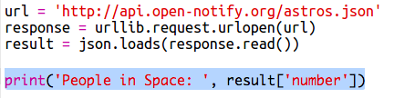

## ಬಾಹ್ಯಾಕಾಶದಲ್ಲಿ ಯಾರು?

ನೀವು ಜಾಗದ ಬಗ್ಗೆ ಲೈವ್ ಮಾಹಿತಿಯನ್ನು ಒದಗಿಸುವ ವೆಬ್ ಸೇವೆಯನ್ನು ಬಳಸಲಿದ್ದೀರಿ. ಮೊದಲಿಗೆ, ಪ್ರಸ್ತುತ ಬಾಹ್ಯಾಕಾಶದಲ್ಲಿ ಯಾರು ಇದ್ದಾರೆ ಎಂಬುದನ್ನು ಕಂಡುಹಿಡಿಯೋಣ.

ವೆಬ್‌ಸೈಟ್ ಮಾಡುವಂತೆಯೇ ವೆಬ್ ಸೇವೆಯು ವಿಳಾಸವನ್ನು (URL) ಹೊಂದಿರುತ್ತದೆ. ವೆಬ್ ಪುಟಕ್ಕಾಗಿ HTML ಅನ್ನು ಹಿಂದಿರುಗಿಸುವ ಬದಲು, ಅದು ಡೇಟಾವನ್ನು ಹಿಂದಿರುಗಿಸುತ್ತದೆ.

+ <a href="http://api.open-notify.org/astros.json" target="_blank">the web service</a> ತೆರೆಯಿರಿ ವೆಬ್ ಬ್ರೌಸರ್‌ನಲ್ಲಿ.

ನೀವು ಈ ರೀತಿಯದನ್ನು ನೋಡಬೇಕು:

    {
      "message": "success",
      "number": 3,
      "people": [
        {
          "craft": "ISS",
          "name": "Yuri Malenchenko"
        },
        {
          "craft": "ISS",
          "name": "Timothy Kopra"
        },
        {
          "craft": "ISS",
          "name": "Timothy Peake"
        }
      ]
    }
    

ಡೇಟಾ ಲೈವ್ ಆಗಿದೆ, ಆದ್ದರಿಂದ ನೀವು ಬಹುಶಃ ಸ್ವಲ್ಪ ವಿಭಿನ್ನ ಫಲಿತಾಂಶವನ್ನು ನೋಡುತ್ತೀರಿ. ಡೇಟಾ ಸ್ವರೂಪವನ್ನು `JSON` ಎಂದು ಕರೆಯಲಾಗುತ್ತದೆ ('ಜೇಸನ್' ಎಂದು ಉಚ್ಚರಿಸಲಾಗುತ್ತದೆ).

[[[generic-json]]]

ನೀವು Python ಸ್ಕ್ರಿಪ್ಟ್‌ನಿಂದ ವೆಬ್ ಸೇವೆಯನ್ನು ಕರೆಯಬೇಕಾಗಿದೆ, ಆದ್ದರಿಂದ ನೀವು ಫಲಿತಾಂಶಗಳನ್ನು ಬಳಸಬಹುದು.

+ ಈ trinket: ತೆರೆಯಿರಿ <http://rpf.io/iss-on>{:target="_blank"}.

`urllib.request` ಮತ್ತು `json` ಮಾಡ್ಯೂಲ್‌ಗಳನ್ನು ಈಗಾಗಲೇ `main.py` ಸ್ಕ್ರಿಪ್ಟ್‌ನ ಮೇಲ್ಭಾಗದಲ್ಲಿ ನಿಮಗಾಗಿ ಆಮದು ಮಾಡಲಾಗಿದೆ.

+ ಕೆಳಗಿನ ಕೋಡ್ ಅನ್ನು `main.py` ಗೆ ಸೇರಿಸಿ ನೀವು ಇದೀಗ ಪ್ರವೇಶಿಸಿದ ವೆಬ್ ಸೇವೆಯ URL ಅನ್ನು ವೇರಿಯೇಬಲ್ ಆಗಿ ಸಂಗ್ರಹಿಸಲು:

+ ಈಗ ವೆಬ್ ಸೇವೆಗೆ ಕರೆ ಮಾಡಿ:

+ ಮುಂದೆ ನೀವು JSON ಪ್ರತಿಕ್ರಿಯೆಯನ್ನುPython data structureಗೆ ಲೋಡ್ ಮಾಡಬೇಕಾಗುತ್ತದೆ:

ನೀವು ಈ ರೀತಿಯದನ್ನು ನೋಡಬೇಕು:

    {'message': 'success', 'number': 3, 'people': [{'craft': 'ISS', 'name': 'Yuri Malenchenko'}, {'craft': 'ISS', 'name': 'Timothy Kopra'}, {'craft': 'ISS', 'name': 'Timothy Peake'}]}
    

ಇದು ಮೂರು ಕೀಲಿಗಳನ್ನು ಹೊಂದಿರುವ Python ನಿಘಂಟು:`message`, `number`, ಮತ್ತು `people`.

[[[generic-python-key-value-pairs]]]

ಆ `message` ಮೌಲ್ಯವನ್ನು ಹೊಂದಿದೆ `success` ನೀವು ವೆಬ್ ಸೇವೆಯನ್ನು ಯಶಸ್ವಿಯಾಗಿ ಪ್ರವೇಶಿಸಿದ್ದೀರಿ ಎಂದು ಹೇಳುತ್ತದೆ. ಪ್ರಸ್ತುತ ಬಾಹ್ಯಾಕಾಶದಲ್ಲಿ ಯಾರು ಇದ್ದಾರೆ ಎಂಬುದರ ಆಧಾರದ ಮೇಲೆ ನೀವು `number` ಮತ್ತು ` people` ವಿಭಿನ್ನ ಫಲಿತಾಂಶಗಳನ್ನು ನೋಡುತ್ತೀರಿ ಎಂಬುದನ್ನು ಗಮನಿಸಿ.

ಈಗ ಮಾಹಿತಿಯನ್ನು ಹೆಚ್ಚು ಓದಬಲ್ಲ ರೀತಿಯಲ್ಲಿ ಮುದ್ರಿಸೋಣ.

+ ಮೊದಲಿಗೆ, ಬಾಹ್ಯಾಕಾಶದಲ್ಲಿರುವ ಜನರ ಸಂಖ್ಯೆಯನ್ನು ನೋಡೋಣ ಮತ್ತು ಅದನ್ನು ಮುದ್ರಿಸೋಣ:

`result['number']` ಕೀ `number` ಗೆ ಸಂಬಂಧಿಸಿದ ಮೌಲ್ಯವನ್ನು ಮುದ್ರಿಸುತ್ತದೆ `result` ನಿಘಂಟು. ಉದಾಹರಣೆಯಲ್ಲಿ, ಇದು `3` ಆಗಿದೆ.

+ `people` ಕೀಲಿಯೊಂದಿಗೆ ಸಂಬಂಧಿಸಿದ ಮೌಲ್ಯವು ನಿಘಂಟುಗಳ ಪಟ್ಟಿಯಾಗಿದೆ! ಆ ಮೌಲ್ಯವನ್ನು ವೇರಿಯೇಬಲ್ ಆಗಿ ಇಡೋಣ ಆದ್ದರಿಂದ ನೀವು ಅದನ್ನು ಬಳಸಬಹುದು:

ನೀವು ಈ ರೀತಿಯದನ್ನು ನೋಡಬೇಕು:

    [{'craft': 'ISS', 'name': 'Yuri Malenchenko'}, {'craft': 'ISS', 'name': 'Timothy Kopra'}, {'craft': 'ISS', 'name': 'Timothy Peake'}]
    

+ ಈಗ ನೀವು ಪ್ರತಿ ಗಗನಯಾತ್ರಿಗಳಿಗೆ ಒಂದು ಸಾಲನ್ನು ಮುದ್ರಿಸಬೇಕಾಗಿದೆ. ಇದನ್ನು ಮಾಡಲು ನೀವು Python `for` ಲೂಪ್ ಬಳಸಬಹುದು.

[[[generic-python-for-loop-list]]]

+ ಪ್ರತಿ ಬಾರಿ ಲೂಪ್ ಮೂಲಕ, `p` ಬೇರೆ ಗಗನಯಾತ್ರಿಗಳಿಗೆ ನಿಘಂಟಿಗೆ ಹೊಂದಿಸಲಾಗುವುದು.

+ ನಂತರ ನೀವು `name` ಮತ್ತು `craft` ಗಾಗಿ ಮೌಲ್ಯಗಳನ್ನು ಹುಡುಕಬಹುದು. ಬಾಹ್ಯಾಕಾಶದಲ್ಲಿರುವ ಜನರ ಹೆಸರುಗಳನ್ನು ತೋರಿಸೋಣ:

ನೀವು ಈ ರೀತಿಯದನ್ನು ನೋಡಬೇಕು:

    People in Space:  3
    Yuri Malenchenko
    Timothy Kopra
    Timothy Peake
    

**ಗಮನಿಸಿ:** ನೀವು ಲೈವ್ ಡೇಟಾವನ್ನು ಬಳಸುತ್ತಿರುವಿರಿ, ಆದ್ದರಿಂದ ನಿಮ್ಮ ಫಲಿತಾಂಶಗಳು ಪ್ರಸ್ತುತ ಬಾಹ್ಯಾಕಾಶದಲ್ಲಿರುವ ಜನರ ಸಂಖ್ಯೆಯನ್ನು ಅವಲಂಬಿಸಿರುತ್ತದೆ.