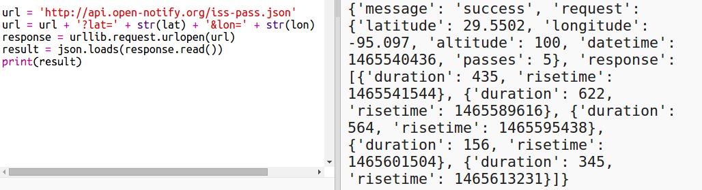

## ISS ಯಾವಾಗ ಓವರ್ಹೆಡ್ ಆಗಿರುತ್ತದೆ?

ISS ಮುಂದಿನ ನಿರ್ದಿಷ್ಟ ಸ್ಥಳದ ಮೇಲೆ ಯಾವಾಗ ಇರುತ್ತದೆ ಎಂಬುದನ್ನು ಕಂಡುಹಿಡಿಯಲು ನೀವು ಬಳಸಬಹುದಾದ ವೆಬ್ ಸೇವೆಯೂ ಇದೆ.

Latitude `29.5502` ನಲ್ಲಿರುವ USA, Houstonನ್ನಲ್ಲಿರುವ Space Centre ಮೇಲೆ ISS ಮುಂದಿನದು ಯಾವಾಗ ಎಂದು ಕಂಡುಹಿಡಿಯೋಣ ಮತ್ತು longitude `95.097`.

+ ಮೊದಲು ಈ ನಿರ್ದೇಶಾಂಕಗಳಲ್ಲಿ ನಕ್ಷೆಯಲ್ಲಿ ಚುಕ್ಕೆ ಹಾಕೋಣ:

ಈಗ ISS ಮುಂದಿನ ಓವರ್ಹೆಡ್ ಆಗಿರುವ ದಿನಾಂಕ ಮತ್ತು ಸಮಯವನ್ನು ಪಡೆಯೋಣ.

+ ಮೊದಲಿನಂತೆ, ವೆಬ್ ಬ್ರೌಸರ್‌ನ ವಿಳಾಸ ಪಟ್ಟಿಗೆ ಅದರ URL ಅನ್ನು ನಮೂದಿಸುವ ಮೂಲಕ ನೀವು ವೆಬ್ ಸೇವೆಯನ್ನು ಕರೆಯಬಹುದು: <a href="http://api.open-notify.org/iss-pass.json" target="_blank">api.open-notify.org/iss-pass.json</a>

ನೀವು ದೋಷವನ್ನು ನೋಡಬೇಕು:

ಈ ವೆಬ್ ಸೇವೆಯು latitude ಮತ್ತುlongitude ವನ್ನು ಇನ್‌ಪುಟ್‌ಗಳಾಗಿ ತೆಗೆದುಕೊಳ್ಳುತ್ತದೆ, ಆದ್ದರಿಂದ ನೀವು ಅವುಗಳನ್ನು URL ನಲ್ಲಿ ಸೇರಿಸಬೇಕಾಗುತ್ತದೆ. ನಂತರ ಇನ್‌ಪುಟ್‌ಗಳನ್ನು ಸೇರಿಸಲಾಗುತ್ತದೆ`?` ಮತ್ತು `&`ನೊಂದಿಗೆ ಬೇರ್ಪಡಿಸಲಾಗಿದೆ.

+ ತೋರಿಸಿರುವಂತೆ url ಗೆ `lat` ಮತ್ತು `lon` ಒಳಹರಿವುಗಳನ್ನು ಸೇರಿಸಿ: <a href="http://api.open-notify.org/iss-pass.json?lat=29.55&lon=95.1" target="_blank">api.open-notify.org/iss-pass.json?lat=29.55&lon=95.1</a>

ಪ್ರತಿಕ್ರಿಯೆಯು ಹಲವಾರು ಪಾಸ್-ಓವರ್ ಸಮಯಗಳನ್ನು ಒಳಗೊಂಡಿದೆ, ಮತ್ತು ನಾವು ಮೊದಲನೆಯದನ್ನು ನೋಡುತ್ತೇವೆ. ಸಮಯವನ್ನು ಯುನಿಕ್ಸ್ time stamp ಆಗಿ ನೀಡಲಾಗಿದೆ (ನಿಮ್ಮPython ಸ್ಕ್ರಿಪ್ಟ್‌ನಲ್ಲಿ ನೀವು ಅದನ್ನು ಓದಬಲ್ಲ ಸಮಯಕ್ಕೆ ಪರಿವರ್ತಿಸಲು ಸಾಧ್ಯವಾಗುತ್ತದೆ).

[[[generic-unix-timestamp]]]

+ ಈಗ ವೆಬ್ ಸೇವೆಯನ್ನು Python ನಿಂದ ಕರೆಯೋಣ. ನಿಮ್ಮ ಸ್ಕ್ರಿಪ್ಟ್‌ನ ಕೊನೆಯಲ್ಲಿ ಈ ಕೆಳಗಿನ ಕೋಡ್ ಅನ್ನು ಸೇರಿಸಿ:

+ ಈಗ ಫಲಿತಾಂಶದಿಂದ ಮೊದಲ ಪಾಸ್-ಓವರ್ ಸಮಯವನ್ನು ಪಡೆಯೋಣ. ಕೆಳಗಿನ ಕೋಡ್ ಸೇರಿಸಿ:

ನಮಗೆ Python `time` ಬೇಕಾಗುತ್ತದೆ ಮಾಡ್ಯೂಲ್ ಆದ್ದರಿಂದ ನಾವು ಅದನ್ನು ಓದಬಲ್ಲ ರೂಪದಲ್ಲಿ ಮುದ್ರಿಸಬಹುದು ಮತ್ತು ಅದನ್ನು ಸ್ಥಳೀಯ ಸಮಯಕ್ಕೆ ಪರಿವರ್ತಿಸಬಹುದು. ನಂತರ ನಾವು ಹೂಸ್ಟನ್‌ಗಾಗಿ ಡಾಟ್ ಮೂಲಕ ಪಾಸ್-ಓವರ್ ಸಮಯವನ್ನು ಬರೆಯಲು ಸ್ಕ್ರಿಪ್ಟ್ ಅನ್ನು ಪಡೆಯುತ್ತೇವೆ.

+ ಅದಕ್ಕೆ `import time` ಸಾಲನ್ನು ನಿಮ್ಮ ಸ್ಕ್ರಿಪ್ಟಿನ ಮೇಲ್ಭಾಗಕ್ಕೆ ಸೇರಿಸಿ:

+ `time.ctime() ` ಕಾರ್ಯವು time stamp ಅನ್ನು ನಿಮ್ಮ ನಕ್ಷೆಯಲ್ಲಿ ಬರೆಯಬಹುದಾದ ಓದಬಲ್ಲ ರೂಪಕ್ಕೆ ಪರಿವರ್ತಿಸುತ್ತದೆ:

(ನೀವು `print` ಸಾಲನ್ನು ತೆಗೆದುಹಾಕಬಹುದು, ಅಥವಾ ಪ್ರಾರಂಭದಲ್ಲಿ `#` ಅನ್ನು ಸೇರಿಸುವ ಮೂಲಕ ಅದನ್ನು ಕಾಮೆಂಟ್ ಆಗಿ ಪರಿವರ್ತಿಸಬಹುದು ಆದ್ದರಿಂದ ನಿಮ್ಮ ಸ್ಕ್ರಿಪ್ಟ್ ಅದನ್ನು ನಿರ್ಲಕ್ಷಿಸುತ್ತದೆ.)

+ ನೀವು ಬಯಸಿದರೆ, ನೀವು ಪಠ್ಯದ ಬಣ್ಣ ಮತ್ತು ಸ್ವರೂಪವನ್ನು ಬದಲಾಯಿಸಬಹುದು. 

[[[generic-python-turtle-write]]]